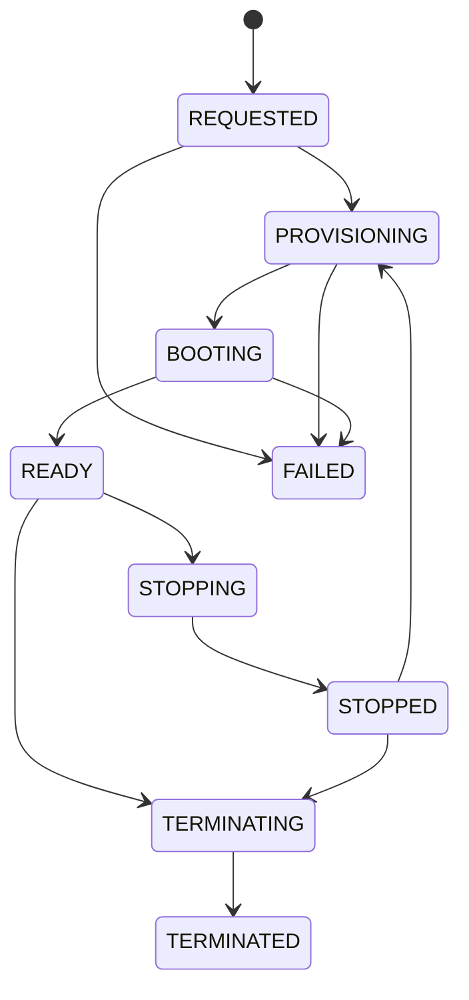

# FastAPI VDI Control Plane

Phase 7 implements the first VDIForge application service: a FastAPI API, PostgreSQL persistence, and an asynchronous provisioner that reconciles VDIForge desktop records into KubeVirt resources. Phase 8 extends that API with remote desktop session brokering for Apache Guacamole.

This document covers the backend control plane through Phase 8. React, Prometheus/Grafana, HPA, and the polished self-service portal remain later phases.

## Version Pins

| Component | Version | Scope | Reference |
| --- | --- | --- | --- |
| Python runtime | 3.14.4 slim | API/provisioner container base | [Python Docker image](https://hub.docker.com/_/python) |
| FastAPI | 0.141.1 | API framework | [FastAPI PyPI](https://pypi.org/project/fastapi/) |
| Pydantic | 2.13.4 | API schema validation | [Pydantic PyPI](https://pypi.org/project/pydantic/) |
| SQLAlchemy | 2.0.52 | ORM | [SQLAlchemy PyPI](https://pypi.org/project/SQLAlchemy/) |
| Alembic | 1.19.1 | database migrations | [Alembic PyPI](https://pypi.org/project/alembic/) |
| psycopg | 3.3.4 | PostgreSQL driver | [psycopg PyPI](https://pypi.org/project/psycopg/) |
| PyJWT | 2.13.0 | JWT validation | [PyJWT PyPI](https://pypi.org/project/PyJWT/) |
| Kubernetes Python client | 36.0.2 | Kubernetes/KubeVirt API access | [kubernetes PyPI](https://pypi.org/project/kubernetes/) |
| cryptography | 50.0.1 | Guacamole JSON-auth token encryption | [cryptography PyPI](https://pypi.org/project/cryptography/) |
| PostgreSQL | 18.0-alpine | application state | [PostgreSQL image](https://hub.docker.com/_/postgres) |

## Components

| Component | Location | Responsibility |
| --- | --- | --- |
| FastAPI API | [backend/app](../backend/app) | validates tokens, enforces RBAC/ownership/quotas, exposes image and desktop APIs |
| Alembic migrations | [backend/alembic](../backend/alembic) | creates desktop, operation, and audit-event tables |
| Provisioner | [backend/app/provisioning](../backend/app/provisioning) | reconciles desired desktop state to Kubernetes/KubeVirt resources |
| Remote access service | [backend/app/services/remote_access.py](../backend/app/services/remote_access.py) | creates signed/encrypted Guacamole JSON-auth handoff URLs |
| Helm deployment | [helm/vdiforge](../helm/vdiforge) | deploys API, provisioner, app PostgreSQL, migration job, ingress, and NetworkPolicies |
| Validation | [scripts/validate-phase7.ps1](../scripts/validate-phase7.ps1), [scripts/validate-phase7-live.sh](../scripts/validate-phase7-live.sh) | static and live Phase 7 checks |

## API Surface

| Method | Path | Auth | Purpose |
| --- | --- | --- | --- |
| `GET` | `/api/v1/health` | no | process health |
| `GET` | `/api/v1/ready` | no | database and image-catalog readiness |
| `GET` | `/api/v1/images` | yes | list launchable images authorized for caller roles |
| `POST` | `/api/v1/desktops` | yes | request a desktop asynchronously |
| `GET` | `/api/v1/desktops` | yes | list caller-owned desktops; admins may pass `all_users=true` |
| `GET` | `/api/v1/desktops/{id}` | yes | retrieve a desktop if owner or admin |
| `POST` | `/api/v1/desktops/{id}/connect` | yes | create a short-lived Guacamole connection handoff for a READY owned desktop |
| `POST` | `/api/v1/desktops/{id}/start` | yes | request start/restart |
| `POST` | `/api/v1/desktops/{id}/stop` | yes | request stop |
| `DELETE` | `/api/v1/desktops/{id}` | yes | request deletion and cleanup |
| `GET` | `/api/v1/audit-events` | admin | inspect audit events |
| `GET` | `/metrics` | no | minimal Prometheus-compatible desktop counters |

API errors use:

```json
{
  "error": {
    "code": "STABLE_ERROR_CODE",
    "message": "Human-readable message.",
    "request_id": "correlation-id"
  }
}
```

## Authorization

FastAPI validates bearer access tokens against Keycloak:

- RS256 signature through the Keycloak JWKS endpoint
- issuer `https://auth.vdiforge.local/realms/vdiforge`
- audience `vdiforge-api`
- expiration
- subject and username claims
- role claims from `roles` and `realm_access.roles`

The validated issuer remains the browser-facing URL:

```text
https://auth.vdiforge.local/realms/vdiforge
```

Inside the cluster, the API uses an explicit internal JWKS URL:

```text
http://vdiforge-keycloak.keycloak.svc.cluster.local:8080/realms/vdiforge/protocol/openid-connect/certs
```

This keeps token issuer validation aligned with browser/OIDC flows while avoiding dependence on the Windows hosts file from inside Kubernetes pods.

Authorization is server-side. The API ignores client-supplied owners or roles.

Current launchable image state:

| Image | Version | Catalog lifecycle | Source PVC | Launchable |
| --- | --- | --- | --- | --- |
| `ubuntu-base` | `1.0.0` | `candidate` | not created | no |
| `ubuntu-developer` | `1.0.0` | `candidate` | not created | no |
| `ubuntu-devops` | `1.0.0` | `available` | `vdiforge-golden-ubuntu-devops-1-0-0` | retained for rollback/history |
| `ubuntu-devops` | `1.1.0` | `available` | `vdiforge-golden-ubuntu-devops-1-1-0` | current default for `vdi-devops` and `vdi-admin` |

## Desktop State

The database stores desired and observed state separately.



Phase 8 records `last_connected_at` and audit events when a connection handoff is created. It does not yet update the desktop to a durable `CONNECTED` state based on actual browser session telemetry.

## Provisioning

The launch request returns `202 Accepted` after the database record is created. The provisioner separately reconciles:

1. source golden PVC exists
2. per-desktop CDI `DataVolume` is cloned from the source PVC
3. KubeVirt `VirtualMachine` is created with `runStrategy: Always`
4. per-desktop remote credential Secret is created for cloud-init and Guacamole brokering
5. ClusterIP Service is created for SSH/RDP access inside the cluster
6. desktop remains `PROVISIONING` until the `DataVolume` is ready
7. VMI readiness plus internal RDP port reachability updates the desktop to `READY`

The local `vdiforge-local-path` StorageClass uses `WaitForFirstConsumer`, so the provisioner creates the `VirtualMachine` and Service before waiting for the `DataVolume` clone to finish. This gives Kubernetes a scheduled consumer, allows the PVC to bind on `vdi-worker-02`, and avoids a storage/provisioning deadlock.

Kubernetes operations use the Kubernetes Python client. The backend application does not shell out to `kubectl` or `virtctl`.

## Deployment

Run from `vdi-control-01` after the repository has been copied or cloned there:

```bash
bash scripts/phase7-create-local-secrets.sh
bash scripts/phase7-prepare-golden-source.sh
bash scripts/phase7-build-load-image.sh
helm upgrade --install vdiforge ./helm/vdiforge \
  --namespace vdiforge-system \
  --values ./helm/vdiforge/values-local.yaml \
  --values ./helm/vdiforge/values-phase5-local.yaml \
  --values ./helm/vdiforge/values-phase7-local.yaml \
  --take-ownership \
  --force-conflicts \
  --wait \
  --wait-for-jobs
```

If Podman or Buildah is present on `vdi-worker-01`, `phase7-build-load-image.sh` builds there over SSH. If neither builder exists, the script uses a temporary BuildKit validation pod and imports the resulting image into containerd on the platform worker. The build/import helper uses temporary privileged validation pods in `vdiforge-desktops`, not `vdiforge-system`, because `vdiforge-system` intentionally enforces baseline pod security while `vdiforge-desktops` is the namespace where KubeVirt privileged launcher behavior is already permitted.

For Phase 8, add remote desktop secrets and values:

```bash
bash scripts/phase8-create-local-secrets.sh
bash scripts/phase8-prepare-remote-source.sh
bash scripts/phase7-build-load-image.sh
kubectl delete job vdiforge-api-migrations -n vdiforge-system --ignore-not-found=true --wait=true
helm upgrade --install vdiforge ./helm/vdiforge \
  --namespace vdiforge-system \
  --values ./helm/vdiforge/values-local.yaml \
  --values ./helm/vdiforge/values-phase5-local.yaml \
  --values ./helm/vdiforge/values-phase7-local.yaml \
  --values ./helm/vdiforge/values-phase8-local.yaml \
  --take-ownership \
  --force-conflicts \
  --wait \
  --wait-for-jobs
```

The Phase 7/8 live validators delete the previous `vdiforge-api-migrations` Job before Helm upgrade because Kubernetes Job pod templates are immutable. After importing the same local image tag, they restart the API and provisioner Deployments so the cluster actually runs the freshly loaded image.

The API and remote desktop ingresses are:

```text
https://api.vdiforge.local
https://remote.vdiforge.local
```

The Windows hosts-file helper includes `auth.vdiforge.local`, `api.vdiforge.local`, and `remote.vdiforge.local`:

```powershell
.\scripts\phase5-windows-hosts-and-trust.ps1
```

## Security Boundary

- `vdiforge-api` ServiceAccount mounts a token only when Phase 8 is enabled so it can read per-desktop remote Secrets and Services in `vdiforge-desktops`.
- `vdiforge-provisioner` ServiceAccount has namespace-scoped access to KubeVirt, CDI, PVC, Service, Secret, Event, and Pod resources in `vdiforge-desktops`.
- No VDIForge component receives `cluster-admin`.
- PostgreSQL is ClusterIP-only.
- Runtime database passwords and TLS private keys are generated under `.local/phase7` and committed only as Kubernetes Secrets in the live lab, not as repository files.
- `vdiforge-system` remains default deny; explicit policies allow DNS, Traefik-to-API, API-to-Keycloak, API/provisioner/migration-to-app-PostgreSQL, and provisioner-to-Kubernetes API.
- Provisioner Kubernetes API egress allows both the in-cluster API Service IP `10.96.0.1:443` and the control-plane endpoint `192.168.56.10:6443` for the current kubeadm lab.
- API Kubernetes API egress is enabled in Phase 8 for authorized remote credential reads.
- Guacamole and `guacd` disable Kubernetes ServiceAccount token mounting.

## Validation

Static validation:

```powershell
.\scripts\validate-phase7.ps1
```

Live validation from `vdi-control-01`:

```bash
bash scripts/validate-phase7-live.sh
```

Live validation proves:

- cluster health remains intact
- Helm lint/render/server dry-run succeeds
- runtime-only secrets exist
- the `ubuntu-devops:1.0.0` golden source PVC exists
- API image is built and loaded on the platform worker
- API, provisioner, migration job, and app PostgreSQL deploy
- API health and readiness work through trusted HTTPS
- RBAC denies privilege escalation
- NetworkPolicy denies unauthorized direct database and API ClusterIP access
- OIDC tokens are accepted by the API
- unauthorized image launch is denied
- idempotency and quota checks work
- desktop launch reaches KubeVirt `READY` on `vdi-worker-02`
- virt-launcher requests `devices.kubevirt.io/kvm`
- stop, restart, delete, and Kubernetes cleanup pass
- audit events persist after API pod restart

Phase 8 live validation adds:

- Guacamole and `guacd` rollout health
- trusted HTTPS access to `remote.vdiforge.local`
- per-desktop remote Secret creation and cleanup
- internal RDP Service reachability from the `guacd` network position
- Guacamole JSON auth token acceptance
- owner/admin connection authorization
- cross-user, guessed-ID, stopped, and deleted desktop connection denial
- connection audit events without credential leakage

The final Phase 7 live validation passed with Helm release revision `56`, KubeVirt hardware acceleration classified as `KUBEVIRT_KVM_VERIFIED`, and the disposable desktop VM scheduled on `vdi-worker-02` with a `devices.kubevirt.io/kvm` request. Phase 8 validation rechecks the same KVM path for the remote-enabled desktop.

## Limitations

- Only `ubuntu-devops` is launchable in the current lab; Phase 8 defaults new launches to `ubuntu-devops:1.1.0`.
- The source golden PVC consumes local-path storage and is not physically highly available.
- The API exposes a minimal `/metrics` endpoint; full Prometheus/Grafana dashboards remain Phase 11.
- Browser remote desktop delivery is available through Guacamole, but the React Connect UI remains Phase 9.
- The API image is a local lab image imported into containerd on `vdi-worker-01`; a registry workflow is deferred.
- The API can read per-desktop remote credential Secrets after authorization; this should be narrowed in a future credential-broker design if practical.
