# VDIForge Architecture

This document contains architecture views for VDIForge. The local VirtualBox infrastructure, Kubernetes/KubeVirt foundation, Helm platform foundation, Keycloak identity foundation, golden-image pipeline, FastAPI control plane, Guacamole remote desktop flow, React portal, API HPA autoscaling, and Prometheus/Grafana observability reflect Phases 2 through 11.

## System Context

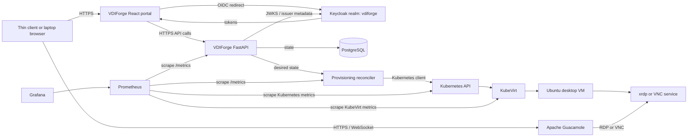

The Ubuntu desktop runs remotely inside the VM. The browser receives graphical session updates through Guacamole and sends keyboard and mouse input.

## Kubernetes Nodes

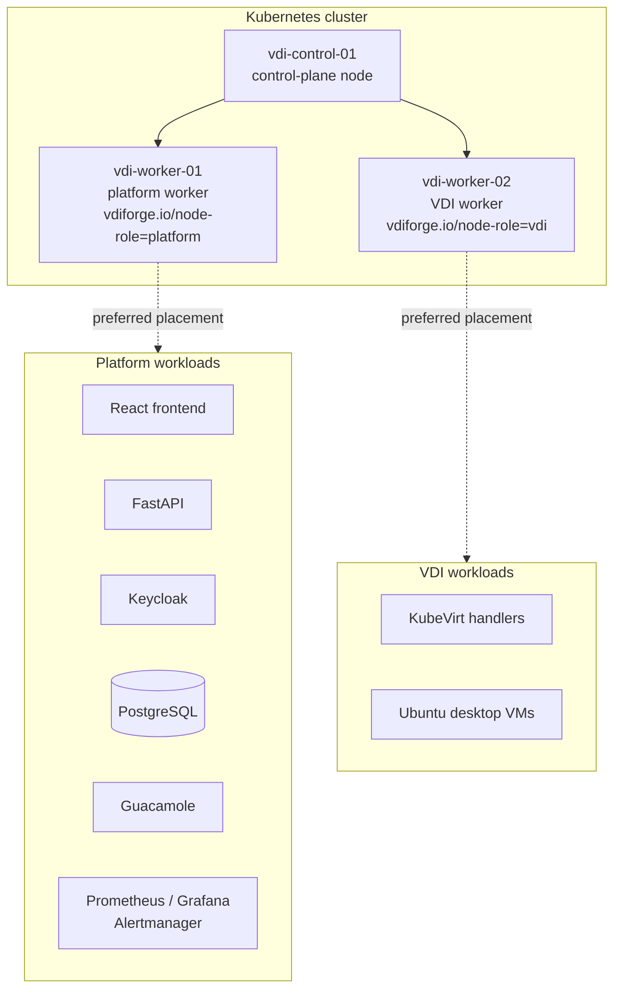

This is a non-HA local topology. When all three nodes are VMs on one host, the physical host remains a single failure domain.

## Local Infrastructure Layers

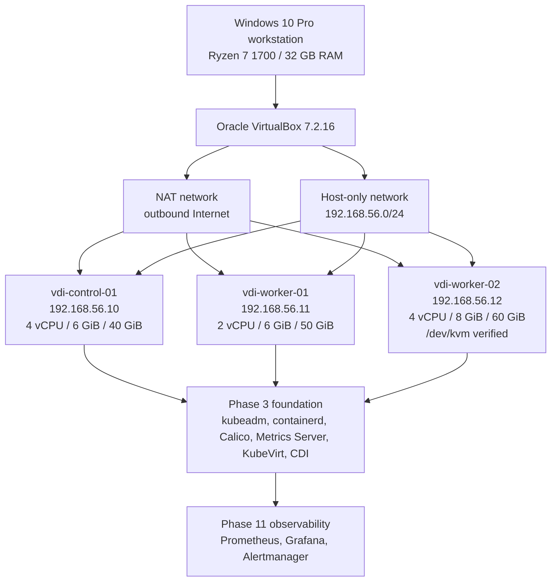

`vdi-worker-02` is the only node that requires nested virtualization for Phase 3. Phase 2 verified `svm` CPU flags and `/dev/kvm` inside the guest; Phase 3 verified KubeVirt exposes and consumes `devices.kubevirt.io/kvm`.

Actual Phase 2 network:

| Node | NAT | Host-only IP | Purpose |
| --- | --- | --- | --- |
| `vdi-control-01` | DHCP | `192.168.56.10` | Kubernetes control-plane node |
| `vdi-worker-01` | DHCP | `192.168.56.11` | platform worker |
| `vdi-worker-02` | DHCP | `192.168.56.12` | KubeVirt/VDI worker |

The host-only adapter address is `192.168.56.1`. DHCP is disabled on the host-only network; static addresses are assigned inside each Ubuntu guest. NAT supplies outbound Internet access.

## Kubernetes/KubeVirt Foundation

```mermaid
flowchart TB
  subgraph Host[Windows 10 Pro host]
    VBox[VirtualBox 7.2.16]
  end

  subgraph Cluster[Kubernetes 1.36.4]
    CP[vdi-control-01<br/>control plane<br/>192.168.56.10]
    W1[vdi-worker-01<br/>platform worker<br/>192.168.56.11<br/>vdiforge.io/node-role=platform]
    W2[vdi-worker-02<br/>VDI worker<br/>192.168.56.12<br/>vdiforge.io/node-role=vdi]
    Calico[Calico v3.32.1<br/>VXLAN pod network<br/>NetworkPolicy]
    Metrics[Metrics Server v0.8.1]
    Storage[vdiforge-local-path<br/>local-path provisioner v0.0.32]
    KV[KubeVirt v1.9.0]
    CDI[CDI v1.66.0]
    TestVM[Disposable CirrOS VM<br/>phase3-cirros]
  end

  VBox --> CP
  VBox --> W1
  VBox --> W2
  CP --> Calico
  CP --> Metrics
  CP --> KV
  KV --> CDI
  CDI --> Storage
  Storage --> TestVM
  KV --> TestVM
  TestVM --> W2
  W2 --> KVM[/dev/kvm<br/>devices.kubevirt.io/kvm]
```

The disposable test VM validates the KubeVirt foundation only. It is not one of the final Ubuntu desktop images and must be deleted after validation.

## Helm Platform Foundation

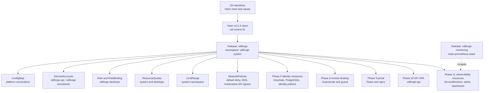

Phase 4 establishes Helm ownership, values conventions, RBAC boundaries, resource governance, NetworkPolicy foundations, and lifecycle validation for install, upgrade, repeated upgrade, and rollback. Later phase values enable the identity, API/provisioner, Guacamole, portal, HPA, and VDIForge observability resources. Phase 11 uses a separate upstream `kube-prometheus-stack` release for the core monitoring stack and the VDIForge chart for app-specific monitoring resources.

## Identity Foundation

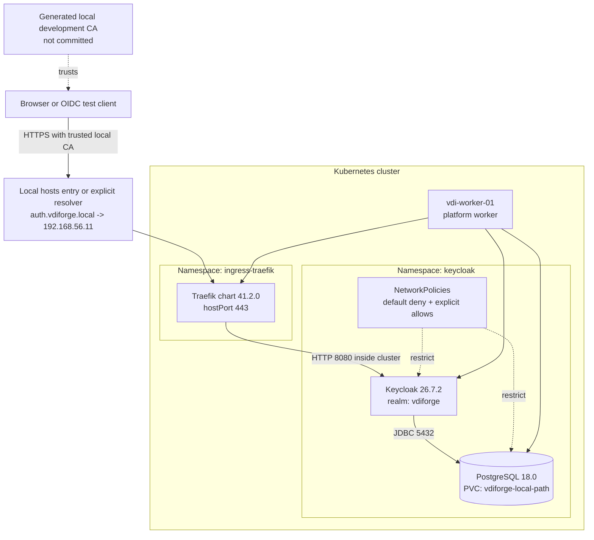

The identity foundation proves OIDC discovery, JWKS, Authorization Code Flow with PKCE, signed JWT validation, expected role claims, unauthorized role absence, negative security cases, and persistence after Keycloak pod recreation. Phase 7 and Phase 8 consume those Keycloak access tokens from the FastAPI API, and Phase 9 uses the public `vdiforge-frontend` client from the React portal.

## API Control Plane

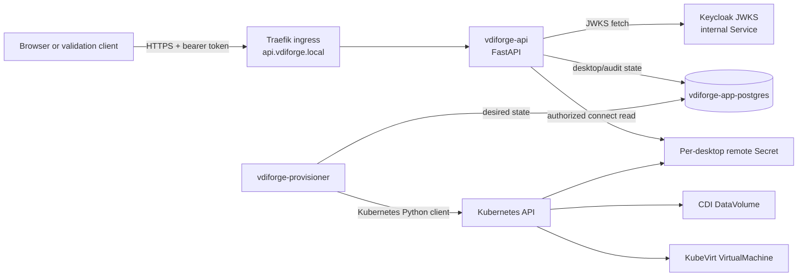

The API validates the external issuer claim `https://auth.vdiforge.local/realms/vdiforge` while using an internal Keycloak Service URL for JWKS retrieval from inside the cluster. This avoids relying on workstation hosts-file DNS from pods.

## API Autoscaling

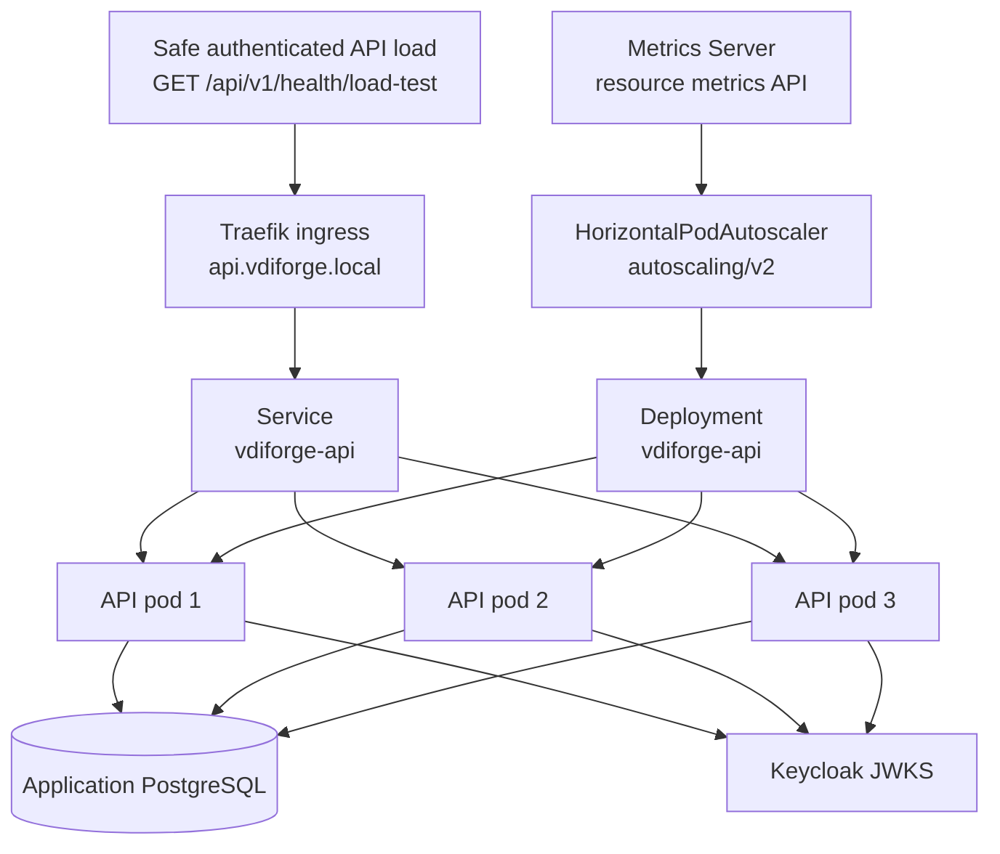

Phase 10 uses Kubernetes `autoscaling/v2` to scale only the stateless FastAPI Deployment. The HPA changes API pod replicas; it does not create KubeVirt desktops, scale the provisioner, or add Kubernetes worker nodes. Provisioner horizontal scaling remains deferred until reconciliation has explicit work coordination such as leader election or database-backed row claiming.

## Authentication Flow

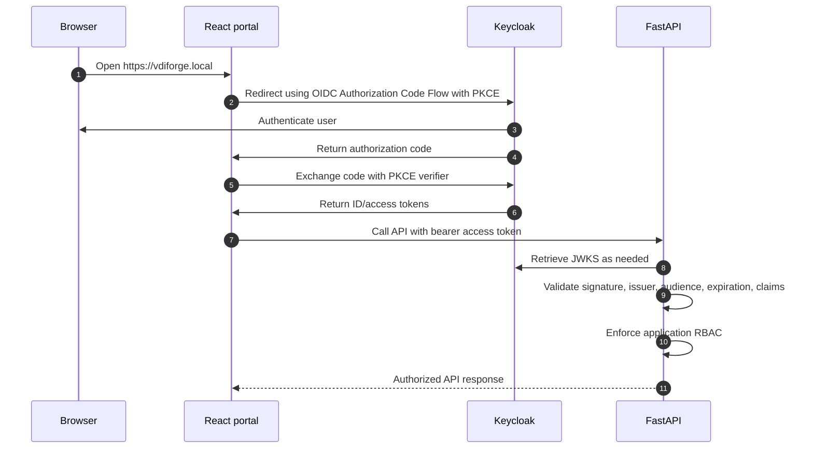

The frontend may hide unauthorized actions for usability, but authorization is enforced by FastAPI.

## Provisioning Flow

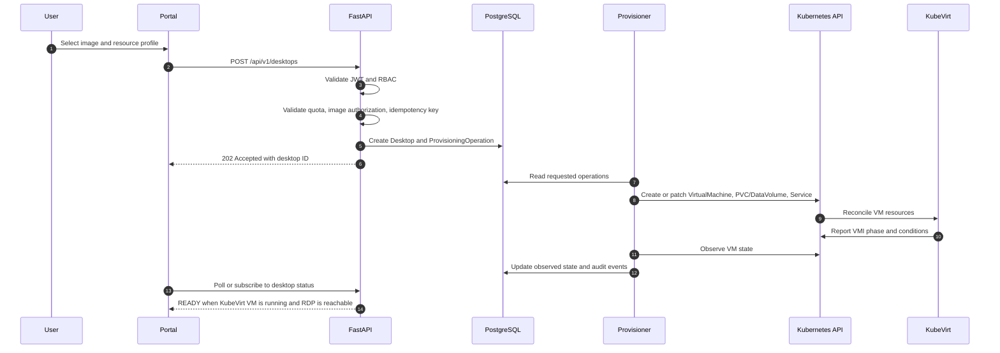

Provisioning is asynchronous. The HTTP request is not held open while a VM boots.

## VDI Lifecycle

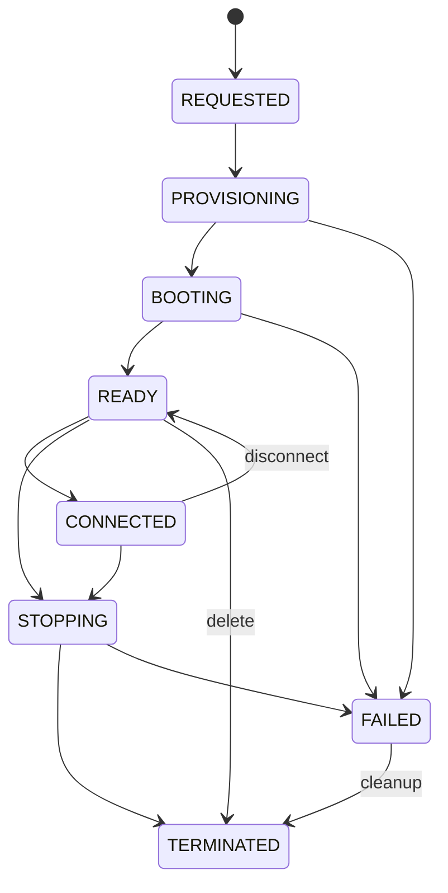

`FAILED` states must include a reason and enough context for troubleshooting without exposing secrets.

## Remote Connection

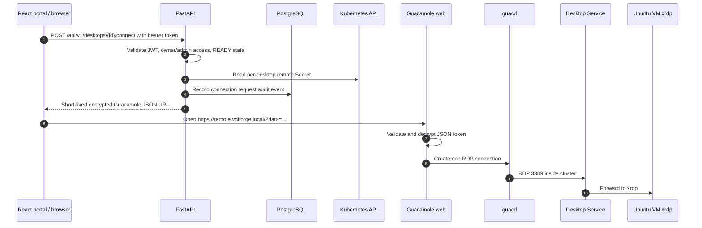

Remote desktop credentials are not returned by the API response. The browser receives only an encrypted Guacamole JSON-auth token with a 300-second TTL. Direct RDP is not exposed outside the cluster.

## Image Pipeline

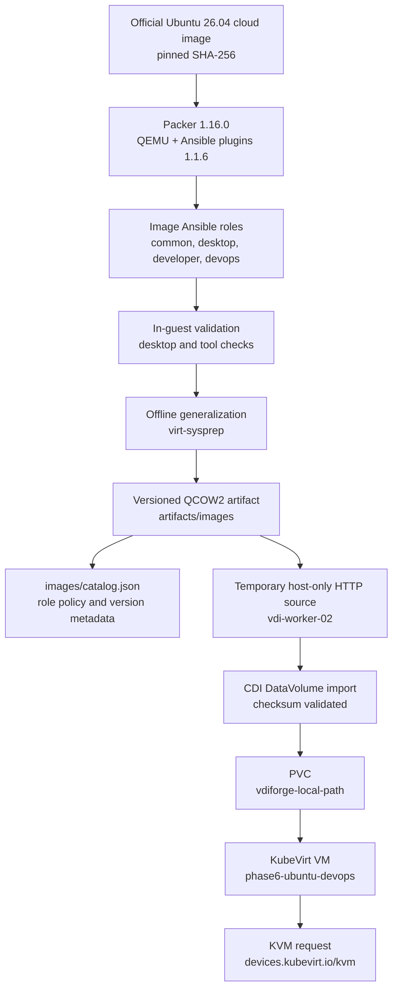

Phase 6 builds `ubuntu-base`, `ubuntu-developer`, and `ubuntu-devops` image definitions. The required integration proof imports the generated `ubuntu-devops:1.0.0` QCOW2 through CDI, schedules a disposable VM by `vdiforge.io/node-role=vdi`, verifies it runs on `vdi-worker-02`, verifies the KVM request, validates DevOps tooling inside the guest, and cleans up the disposable VM resources. Phase 8 builds/imports `ubuntu-devops:1.1.0` for remote desktop validation. Phase 9 promotes `ubuntu-devops:1.2.0` as the current launchable DevOps image with the permanent XFCE/xrdp session fix.

Image rollback changes the promoted version for new launches only. Running desktops are not silently modified by rollback.

## Observability

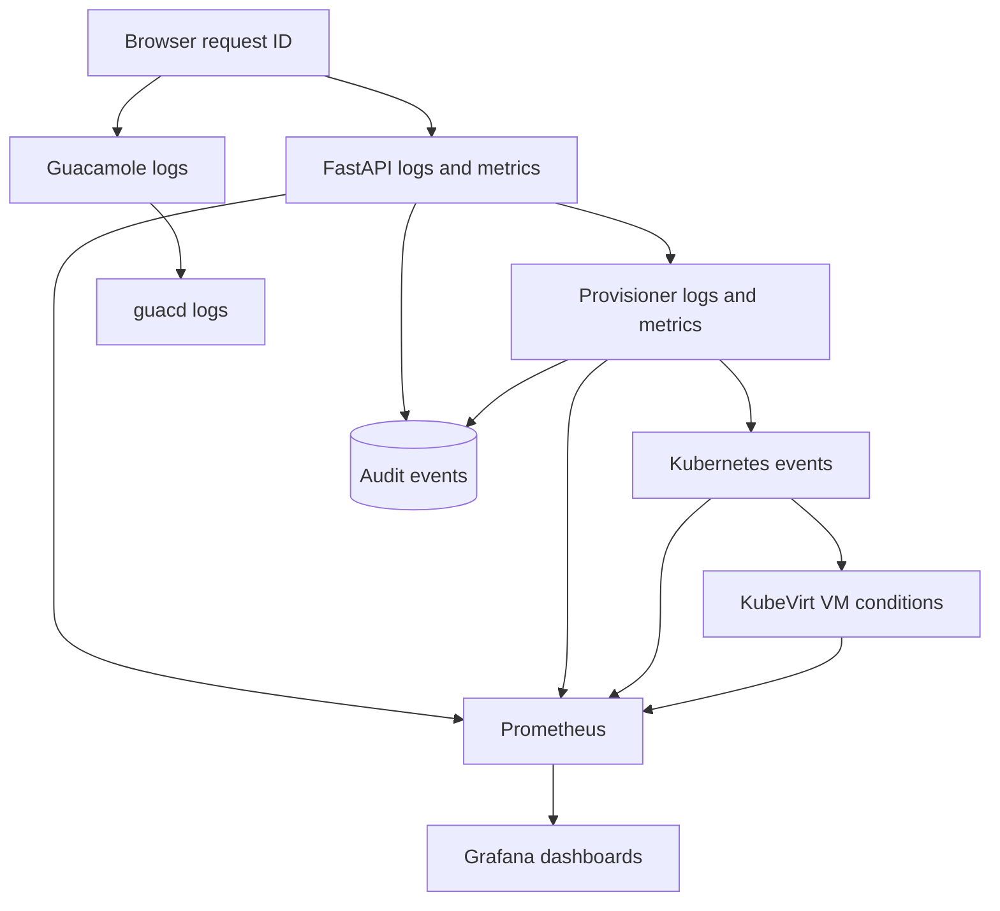

Correlation/request IDs allow a launch operation to be traced across browser, API, provisioner, Kubernetes/KubeVirt, and audit events.
