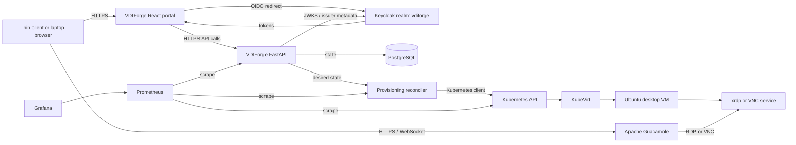
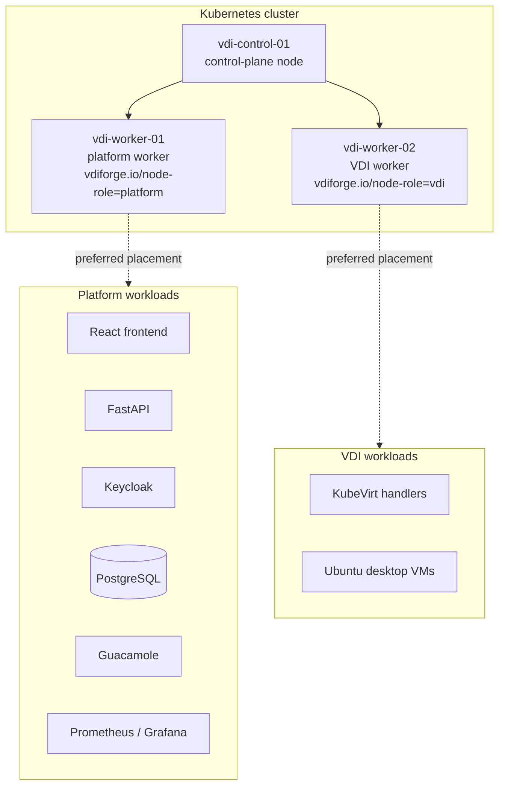
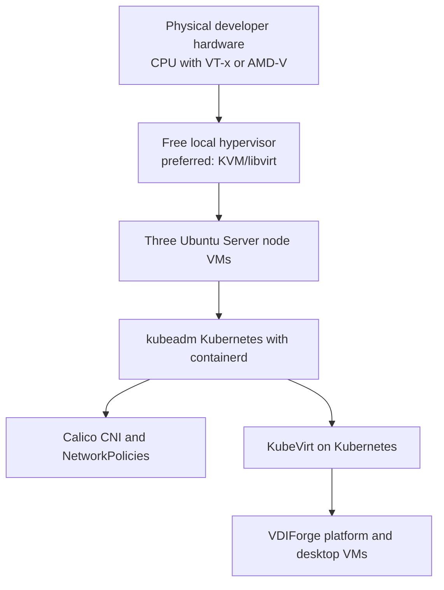
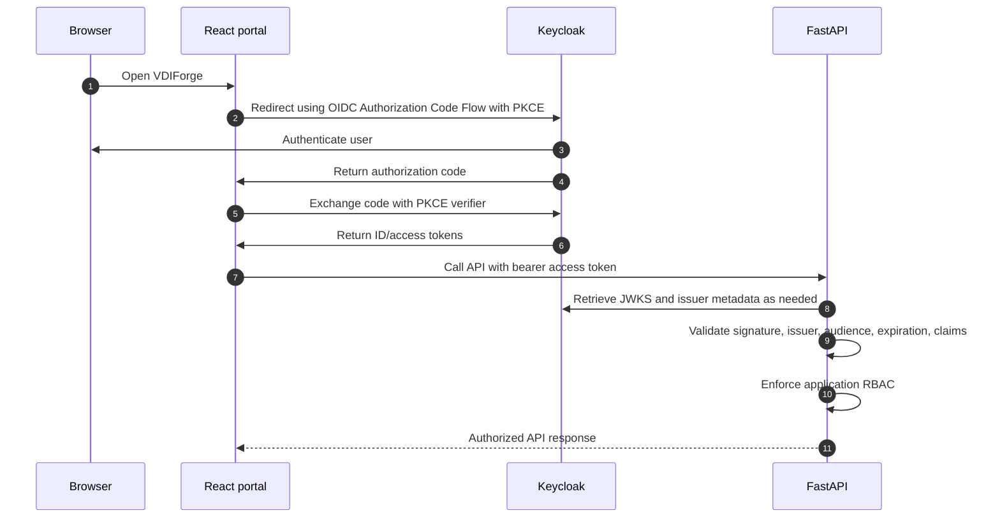
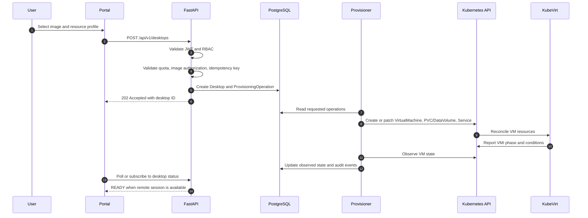
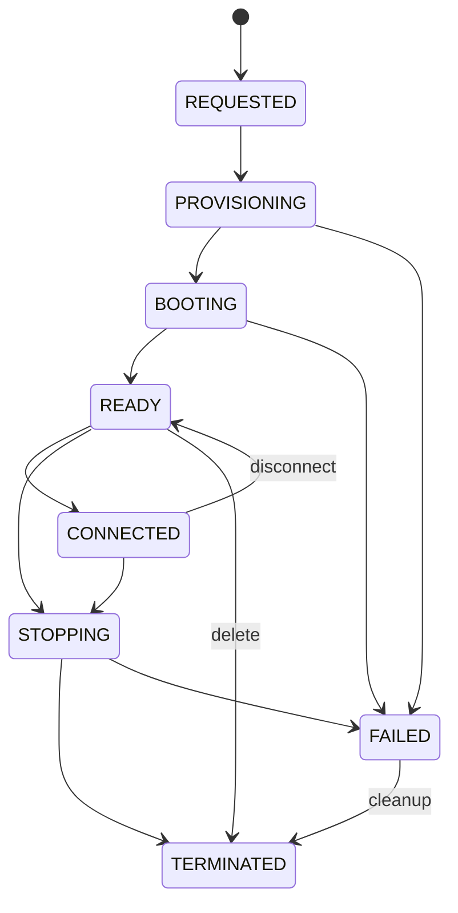
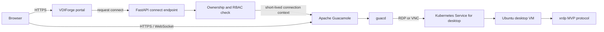
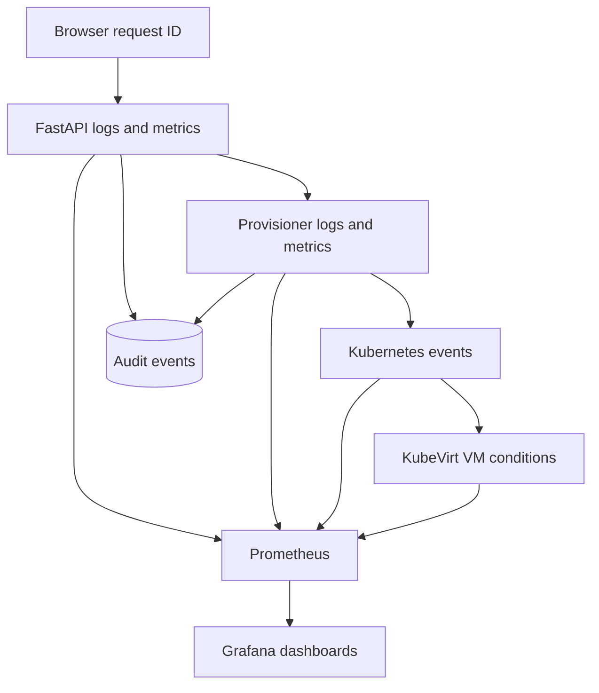

# VDIForge Architecture

This document contains the Phase 1 architecture views for VDIForge. The diagrams show planned architecture, not an implemented system.

## System Context

The Ubuntu desktop runs remotely inside the VM. The browser receives graphical session updates through Guacamole and sends keyboard and mouse input.

## Kubernetes Nodes

This is a non-HA local topology. When all three nodes are VMs on one host, the physical host remains a single failure domain.

## Local Infrastructure Layers

Nested virtualization must be validated before using a VM-based worker node for KubeVirt workloads.

## Authentication Flow

The frontend may hide unauthorized actions for usability, but authorization is enforced by FastAPI.

## Provisioning Flow

Provisioning is asynchronous. The HTTP request is not held open while a VM boots.

## VDI Lifecycle

`FAILED` states must include a reason and enough context for troubleshooting without exposing secrets.

## Remote Connection

Remote desktop credentials and backend connection details are not exposed to frontend JavaScript.

## Image Pipeline

```mermaid
flowchart LR
  Source[Trusted Ubuntu source]
  Verify[Checksum and signature verification]
  Packer[Packer build]
  Ansible[Ansible configuration]
  Validate[Image validation]
  Scan[Security checks]
  Artifact[Versioned artifact]
  Test[Test launch]
  Promote[Promotion to image catalog]

  Source --> Verify
  Verify --> Packer
  Packer --> Ansible
  Ansible --> Validate
  Validate --> Scan
  Scan --> Artifact
  Artifact --> Test
  Test --> Promote
```

Image rollback changes the promoted version for new launches only. Running desktops are not silently modified by rollback.

## Observability

Correlation/request IDs allow a launch operation to be traced across browser, API, provisioner, Kubernetes/KubeVirt, and audit events.
