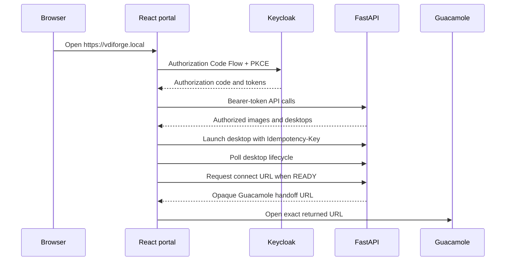

# VDIForge Technical Design

This document is the authoritative technical design for VDIForge. Later implementation phases must update this document or create an ADR before deviating from these decisions.

## Status

Phase 2 local infrastructure foundation is documented and host-validated. Phase 3 establishes the Kubernetes and KubeVirt foundation on that lab with kubeadm, containerd, Calico, Metrics Server, KubeVirt, CDI, local-path storage, namespace/RBAC foundations, NetworkPolicy validation, and a disposable KubeVirt test VM. Phase 4 establishes the Helm platform foundation with a `vdiforge` release that manages VDIForge ConfigMap conventions, ServiceAccounts, provisioner RBAC, ResourceQuotas, a LimitRange, and baseline NetworkPolicies. Phase 5 adds Keycloak, PostgreSQL persistence, Traefik ingress, local TLS, realm import, demo identities, Authorization Code Flow with PKCE validation, JWT validation, RBAC claim validation, and identity NetworkPolicies. Phase 6 establishes the Packer/Ansible Ubuntu golden-image pipeline, image catalog foundation, QCOW2 artifact format, CDI import path, and KubeVirt boot validation. Phase 7 adds the FastAPI VDI control plane, application PostgreSQL, Alembic migrations, API/provisioner Helm resources, server-side authorization, audit persistence, and KubeVirt desktop lifecycle reconciliation. Phase 8 adds Apache Guacamole, `guacd`, RDP/xrdp session delivery, short-lived JSON-auth connection brokering, per-desktop remote credentials, and remote-session validation. Phase 9 adds the React/TypeScript self-service portal at `https://vdiforge.local`. Phase 10 adds Kubernetes HPA autoscaling for `vdiforge-api`. Phase 11 adds kube-prometheus-stack, Prometheus, Grafana, Alertmanager, VDIForge ServiceMonitors, alert rules, dashboard-as-code, and API/provisioner metrics.

## Goals

- Provide a small self-service VDI platform suitable for a senior platform engineering portfolio.
- Keep the MVP reproducible on local hardware with approximately zero infrastructure and software licensing cost.
- Use real VM lifecycle management through KubeVirt, not desktop-like containers.
- Use OIDC and server-side authorization for access decisions.
- Keep the design simple enough to demonstrate reliably in an interview setting.
- Make infrastructure, host configuration, application deployment, and image build responsibilities explicit.
- Design observability, audit logging, security controls, operations, and tests before implementation.

## Non-Goals

- Production high availability for the first local lab.
- Paid AWS resources, AWS bare-metal instances, commercial VMware, commercial VDI products, Windows desktops, PCoIP licensing, paid Okta, or paid Ping Identity.
- Reproducing any proprietary cloud provider architecture.
- Adding Kafka, service meshes, OpenStack, Ceph, Vault clusters, Argo CD, Crossplane, or Elasticsearch without a specific later requirement.
- Synchronous VM provisioning inside a single HTTP request.
- Treating frontend visibility controls as security.

## Design Principles

- Reproducibility: later phases should be rebuildable from source-controlled definitions and documented commands.
- Idempotency: provisioning and configuration should tolerate retries.
- Least privilege: application services and Kubernetes ServiceAccounts receive only the permissions they need.
- Separation of concerns: Terraform, Ansible, Helm, Packer, Kubernetes, and application code have distinct ownership.
- Declarative configuration: desired state should be expressed in code where practical.
- Immutable images: patched desktops are produced by rebuilding versioned images.
- Observability by design: metrics, logs, dashboards, and audit records are first-class requirements.
- Security by design: authentication, authorization, secret handling, and network isolation are part of the baseline.
- Testability: requirements are written so later phases can map implementation and test evidence.
- Portability: local lab choices should not block future bare-metal or cloud deployment.
- Simple failure recovery: operations should be diagnosable with standard Linux, Kubernetes, and application tools.

## Research Baseline

Sources reviewed during Phase 1:

- KubeVirt installation requirements and runtime support: [KubeVirt installation guide](https://kubevirt.io/user-guide/cluster_admin/installation/)
- KubeVirt Kubernetes compatibility policy: [KubeVirt Kubernetes compatibility](https://github.com/kubevirt/kubevirt/blob/main/docs/kubernetes-compatibility.md)
- KubeVirt software emulation fallback: [KubeVirt software emulation](https://github.com/kubevirt/kubevirt/blob/main/docs/software-emulation.md)
- KubeVirt architecture: [KubeVirt architecture](https://github.com/kubevirt/user-guide/blob/main/docs/architecture.md)
- Kubernetes active release support: [Kubernetes releases](https://kubernetes.io/releases/)
- Calico Kubernetes support and NetworkPolicy behavior: [Calico system requirements](https://docs.tigera.io/calico/latest/getting-started/kubernetes/requirements)
- Calico and KubeVirt networking notes: [Calico KubeVirt networking](https://docs.tigera.io/calico/latest/networking/kubevirt/kubevirt-networking)
- KubeVirt NetworkPolicy behavior: [KubeVirt NetworkPolicy](https://kubevirt.io/user-guide/network/networkpolicy/)
- Apache Guacamole architecture and protocol support: [Guacamole architecture](https://guacamole.apache.org/doc/gug/guacamole-architecture.html) and [Guacamole configuration](https://guacamole.apache.org/doc/gug/configuring-guacamole.html)
- Keycloak OIDC flows and role claims: [Keycloak server administration guide](https://www.keycloak.org/docs/latest/server_admin/)
- Terraform libvirt provider status: [dmacvicar/libvirt Terraform provider](https://registry.terraform.io/providers/dmacvicar/libvirt/latest/docs)
- Phase 2 local host implementation: [Local Infrastructure](LOCAL-INFRASTRUCTURE.md)
- Phase 3 Kubernetes/KubeVirt implementation: [Kubernetes and KubeVirt Foundation](KUBERNETES-KUBEVIRT.md)
- Phase 4 Helm implementation: [Helm Platform Foundation](HELM-PLATFORM.md)
- Helm version support and installation: [Helm v4 version support policy](https://blog.helm.sh/docs/topics/version_skew/) and [Helm install documentation](https://helm.sh/docs/intro/install/)
- Phase 5 identity implementation: [Keycloak, OIDC, and RBAC Foundation](KEYCLOAK-OIDC.md)
- Keycloak Phase 5 references: [Keycloak database configuration](https://www.keycloak.org/server/db), [Keycloak reverse proxy configuration](https://www.keycloak.org/server/reverseproxy), [Keycloak import/export](https://www.keycloak.org/server/importExport), [Keycloak OIDC endpoints](https://www.keycloak.org/securing-apps/oidc-layers), and [Keycloak health endpoints](https://www.keycloak.org/observability/health)
- Phase 6 image pipeline implementation: [Golden Images](GOLDEN-IMAGES.md)
- Packer and image references: [Packer install documentation](https://developer.hashicorp.com/packer/install), [Packer QEMU plugin](https://developer.hashicorp.com/packer/integrations/hashicorp/qemu), [Packer Ansible plugin](https://developer.hashicorp.com/packer/integrations/hashicorp/ansible), [Ubuntu 26.04 cloud images](https://cloud-images.ubuntu.com/releases/resolute/release/), [CDI DataVolumes](https://github.com/kubevirt/containerized-data-importer/blob/main/doc/datavolumes.md), and [KubeVirt VM access](https://kubevirt.io/user-guide/user_workloads/accessing_virtual_machines/)
- Phase 7 control plane implementation: [FastAPI VDI Control Plane](API-CONTROL-PLANE.md)
- Phase 8 remote desktop implementation: [Remote Desktop Delivery](REMOTE-DESKTOP.md)
- Apache Guacamole JSON authentication: [Guacamole JSON authentication](https://guacamole.apache.org/doc/gug/json-auth.html)
- Phase 9 portal implementation: [React Self-Service Portal](WEB-PORTAL.md)

## Selected Platform Version Pins

These pins are Phase 3 implementation inputs as of 2026-08-27. Later phases must re-check compatibility before changing them and must record substantive changes in an ADR.

| Component | Selected pin | Rationale |
| --- | --- | --- |
| Ubuntu Server | 26.04 LTS | Actual Phase 2 node baseline installed from `ubuntu-26.04-live-server-amd64.iso`; Phase 3 compatibility gate validated this as a supported LTS baseline. |
| Kubernetes | 1.36.4 | Active Kubernetes 1.36 release line; `apt-cache madison` confirmed `1.36.4-1.1` is the available pinned package revision in the official v1.36 repository. |
| KubeVirt | 1.9.0 | Release notes state it targets Kubernetes 1.36 and supports the previous two minor releases. |
| Calico | 3.32.1 | Calico 3.32 documentation lists Kubernetes 1.34, 1.35, and 1.36 as tested versions. |
| Metrics Server | 0.8.1 | Metrics Server 0.8.x supports Kubernetes 1.31 and newer. |
| CDI | 1.66.0 | CDI release paired with the KubeVirt 1.9 release train and needed for DataVolume validation. |
| Local-path provisioner | 0.0.32 | Simple local dynamic storage for the lab; documented in ADR 0010. |
| Helm | 4.2.4 | Current stable Helm v4 release line; v4.2.x supports Kubernetes 1.36.x through 1.33.x. |
| Keycloak | 26.7.2 | Phase 5 identity provider from the official Keycloak image. |
| PostgreSQL | 18.0-alpine | Phase 5 single-instance local persistence for Keycloak. |
| Traefik Helm chart | 41.2.0 | Phase 5 local ingress controller for `auth.vdiforge.local`. |
| Packer | 1.16.0 | Phase 6 image build client installed in the Linux/KVM build environment. |
| Packer QEMU plugin | 1.1.6 | Phase 6 builder for KVM-backed QCOW2 images. |
| Packer Ansible plugin | 1.1.6 | Phase 6 provisioner for applying Ansible image playbooks during Packer builds. |
| Ubuntu image source | Ubuntu 26.04 LTS amd64 cloud image | Official cloud-image source with pinned SHA-256 checksum. |
| Terraform in DevOps image | 1.16.0 | Pinned binary installed into `ubuntu-devops`. |
| kubectl in DevOps image | v1.36.4 | Matches the local cluster minor/patch version. |
| Helm in DevOps image | v4.2.4 | Matches the Phase 4/5 administrative Helm client. |
| Terraform local lab | Terraform 1.15.8 with built-in `terraform_data` | Actual Phase 2 host uses VirtualBox; Terraform validates the lab specification without depending on an alpha VirtualBox provider. |
| Apache Guacamole | 1.6.0 | Phase 8 browser remote desktop gateway with JSON authentication enabled. |
| guacd | 1.6.0 | Phase 8 protocol proxy between Guacamole web and desktop RDP services. |
| React | 19.2.8 | Phase 9 browser portal. |
| TypeScript | 6.0.3 | Phase 9 frontend language and static checks. |
| Vite | 8.2.2 | Phase 9 frontend build tool. |
| oidc-client-ts | 3.5.0 | Phase 9 browser OIDC Authorization Code Flow with PKCE. |
| Remote desktop protocol | RDP through xrdp | MVP remote protocol for Ubuntu/XFCE desktops; VNC remains fallback. |
| Python runtime | 3.14.4 slim | API/provisioner container runtime. |
| FastAPI | 0.141.1 | Phase 7 API framework. |
| Pydantic | 2.13.4 | Phase 7 schema validation. |
| SQLAlchemy | 2.0.52 | Phase 7 ORM. |
| Alembic | 1.19.1 | Phase 7 database migrations. |
| psycopg | 3.3.4 | Phase 7 PostgreSQL driver. |
| PyJWT | 2.13.0 | Phase 7 JWT validation. |
| Kubernetes Python client | 36.0.2 | Phase 7 Kubernetes/KubeVirt API access. |

No implementation phase should use floating `latest` tags for platform components, images, or charts.

## Infrastructure Design

The initial lab uses three Ubuntu Server Kubernetes nodes:

| Node | Kubernetes role | Intended workload class |
| --- | --- | --- |
| `vdi-control-01` | control-plane node | Kubernetes control plane |
| `vdi-worker-01` | worker node | Platform services such as API, Keycloak, Guacamole, PostgreSQL, monitoring |
| `vdi-worker-02` | worker node | VDI-oriented workloads, KubeVirt VirtualMachineInstances |

The nodes may initially be VMs running on a free local hypervisor. The preferred no-cost path remains a Linux host with KVM/libvirt because it aligns directly with KubeVirt's KVM dependency and has a stronger Terraform provider story. The actual Phase 2 host cannot use that path, so [ADR 0009](ADR/0009-virtualbox-local-lab-on-windows.md) accepts Oracle VirtualBox 7.2.16 on Windows 10 Pro for this local lab.

Current local lab node resources:

| Node | CPU | RAM | Disk | Host-only IP | Status |
| --- | ---: | ---: | ---: | --- | --- |
| `vdi-control-01` | 4 vCPU | 6144 MiB | 40 GiB | `192.168.56.10` | SSH and Kubernetes control-plane verified |
| `vdi-worker-01` | 2 vCPU | 6144 MiB | 50 GiB | `192.168.56.11` | SSH verified |
| `vdi-worker-02` | 4 vCPU | 8192 MiB | 60 GiB | `192.168.56.12` | SSH and `/dev/kvm` verified |

Each VM uses NAT for outbound package access and a VirtualBox host-only adapter on `192.168.56.0/24` for host administration and node-to-node traffic.

If all three nodes run on one physical computer, they are only logical failure domains. The lab still demonstrates real Kubernetes concepts:

- control-plane and worker roles
- scheduling
- workload placement
- labels
- taints and tolerations where justified
- affinity
- node failures
- resource requests and limits
- logical node pools

Suggested labels:

```text
vdiforge.io/node-role=platform
vdiforge.io/node-role=vdi
```

Phase 3 scheduling behavior:

- Platform services prefer `vdi-worker-01`.
- KubeVirt VM workloads prefer `vdi-worker-02`.
- Hard scheduling constraints should be used only when a workload truly cannot run elsewhere.
- Soft affinity is preferred for demonstrability unless isolation, hardware, or capacity requires hard placement.

## Kubernetes Design

The local cluster is built with:

- kubeadm for bootstrap
- containerd as the container runtime
- Calico as the CNI
- Metrics Server for resource metrics
- namespaces for logical separation
- Kubernetes RBAC
- dedicated ServiceAccounts
- resource requests and limits
- NetworkPolicies
- HorizontalPodAutoscaler for eligible stateless platform workloads

Planned namespaces:

| Namespace | Purpose |
| --- | --- |
| `vdiforge-system` | FastAPI, provisioner, frontend, shared app resources |
| `vdiforge-desktops` | KubeVirt desktop resources |
| `keycloak` | Keycloak and its supporting resources |
| `guacamole` | Guacamole web application and guacd |
| `monitoring` | Prometheus, Grafana, exporters |
| `kubevirt` | KubeVirt operator and core components |

Calico is selected because it supports Kubernetes NetworkPolicy, has a current release line tested with Kubernetes 1.34 through 1.36, and has specific KubeVirt networking documentation. The MVP should use standard Kubernetes NetworkPolicy first. Calico-specific policy features may be added later only when standard NetworkPolicy is insufficient.

## KubeVirt Design

KubeVirt is the target VM lifecycle layer. VDIForge creates and reconciles KubeVirt resources through the Kubernetes API.

Planned resource relationship:

```text
VDIForge Desktop
       |
       v
KubeVirt VirtualMachine
       |
       v
VirtualMachineInstance
       |
       +---- PersistentVolumeClaim or DataVolume
       |
       +---- Service
       |
       +---- Remote desktop service inside guest
```

Relevant resource types:

- `VirtualMachine`
- `VirtualMachineInstance`
- `DataVolume` where image import or cloning uses Containerized Data Importer
- `PersistentVolumeClaim`
- `Service`
- `NetworkPolicy`
- `Secret` only for runtime credentials that cannot be avoided

KubeVirt runs VMs in Kubernetes-managed pods and delegates scheduling, networking, and storage integration to Kubernetes while using QEMU/KVM for virtualization.

## Nested Virtualization and KubeVirt Verification

KubeVirt normally expects hardware virtualization through `/dev/kvm`. For a local cluster where Kubernetes nodes are themselves VMs, the physical CPU must support Intel VT-x or AMD-V and the outer hypervisor must expose nested virtualization into the node VMs.

Feasibility conclusion:

- Best local target: Linux host with KVM/libvirt and nested virtualization enabled for the Kubernetes node VMs.
- Required validation: each Kubernetes worker that may host KubeVirt VMs must expose `/dev/kvm`, load KVM kernel modules, and pass KubeVirt node checks.
- Important limitation: if `/dev/kvm` is unavailable, KubeVirt VM startup may fail unless software emulation is enabled.
- Fallback: KubeVirt `useEmulation: true` can support development-only validation but will be slower and should not be used for a performance-oriented demo.
- Actual Phase 2 result: VirtualBox nested virtualization is verified on `vdi-worker-02` because `svm` flags are visible in `/proc/cpuinfo` and `/dev/kvm` exists inside the guest.
- Actual Phase 3 result: KubeVirt exposes `devices.kubevirt.io/kvm` on `vdi-worker-02`, and the disposable `phase3-cirros` VM ran on that node with a KVM device request.

Phase 2 validation commands:

```bash
lscpu | grep -E 'Virtualization|vmx|svm'
lsmod | grep kvm
test -e /dev/kvm
sudo kvm-ok
```

Phase 3 Kubernetes/KubeVirt validation adds:

```bash
kubectl get nodes -o wide
kubectl -n kubevirt get pods
kubectl get node vdi-worker-02 -o json | jq -r '.status.allocatable["devices.kubevirt.io/kvm"]'
```

This risk is tracked in [ADR 0002](ADR/0002-kubevirt-for-vm-workloads.md) and [ADR 0008](ADR/0008-local-three-node-development-cluster.md).

## Terraform Boundary

Terraform manages infrastructure lifecycle, not per-user desktop launches.

Terraform responsibilities:

- validated local VirtualBox lab specification for this Windows host
- node CPU, memory, disk, role, IP, and SSH-target metadata
- local virtual networks and storage pools where a maintained provider is practical
- reusable infrastructure modules
- future cloud infrastructure
- environment-level variables and outputs

Terraform must not be invoked by the VDIForge application for every Launch click. User desktop lifecycle is handled by the backend calling Kubernetes/KubeVirt APIs.

The maintained `dmacvicar/libvirt` provider remains the preferred candidate for a future Linux KVM/libvirt environment. For the actual Windows/VirtualBox host, Phase 2 intentionally avoids making an alpha or weakly maintained VirtualBox provider authoritative. Terraform uses the built-in `terraform_data` resource to validate and output the lab specification while VM lifecycle remains VirtualBox GUI or `VBoxManage`.

Terraform state, tfvars, credentials, and generated plans must not be committed.

## Ansible Boundary

Ansible configures operating systems and hosts. Phase 2 introduced:

```text
common
security-baseline
```

Phase 3 adds:

```text
containerd
kubernetes-common
kubernetes-control-plane
kubernetes-worker
```

The current Windows host does not provide a native Ansible control environment. Phase 2 ran syntax, lint, connectivity, and idempotency checks from `vdi-control-01` as a temporary Ubuntu VM controller. Phase 3 continues to use `vdi-control-01` as the practical Ansible controller for kubeadm and add-on bootstrap.

Phase 6 adds dedicated image roles:

```text
image-common
image-desktop
image-developer
image-devops
image-cleanup
```

These roles run inside disposable Packer build guests. They do not configure Kubernetes nodes.

## Helm Boundary

Helm deploys VDIForge platform and application resources into Kubernetes. Phase 4 creates the foundation chart at `helm/vdiforge` and validates a release named `vdiforge` in `vdiforge-system`:

```bash
helm upgrade --install vdiforge ./helm/vdiforge \
  --namespace vdiforge-system \
  --values ./helm/vdiforge/values-local.yaml \
  --take-ownership \
  --force-conflicts \
  --wait
```

Phase 4 chart resources:

- ConfigMap for non-sensitive platform conventions
- ServiceAccounts for future API and provisioner components
- namespace-scoped provisioner Role and RoleBinding for VDI resources
- ResourceQuotas for `vdiforge-system` and `vdiforge-desktops`
- LimitRange for future small platform containers
- NetworkPolicies for `vdiforge-system` default deny, DNS egress, and future provisioner Kubernetes API egress

With `values-local.yaml` alone, the Helm chart does not create application Deployments, Services, Ingress, HPA, Keycloak, Guacamole, Prometheus, Grafana, or VDI desktops. Phase 5 enables only the identity stack through `values-phase5-local.yaml`, Phase 7 enables the API/provisioner stack through `values-phase7-local.yaml`, Phase 8 enables Guacamole through `values-phase8-local.yaml`, Phase 9 enables the frontend through `values-phase9-local.yaml`, and Phase 10 enables API autoscaling through `values-phase10-local.yaml`.

Phase-enabled chart resources:

- frontend Deployment, Service, Ingress
- FastAPI Deployment, Service, Ingress
- provisioning worker Deployment
- API HPA definition for `vdiforge-api`

Third-party systems should use established upstream charts or images when that is simpler and safer than maintaining custom manifests. Phase 5 uses the official Keycloak and PostgreSQL images directly in the VDIForge chart, and installs Traefik with its upstream Helm chart as shared ingress infrastructure.

## Ubuntu Image Architecture

Initial image catalog:

| Image | Purpose |
| --- | --- |
| `ubuntu-base:1.0.0` | Minimal XFCE Ubuntu desktop suitable for future remote access. |
| `ubuntu-developer:1.0.0` | Developer desktop with Git, Python, build tools, CLI utilities, and Geany. |
| `ubuntu-devops:1.0.0` | Infrastructure desktop with Terraform, Ansible, kubectl, Helm, Git, Python, and useful infrastructure CLIs. |
| `ubuntu-devops:1.1.0` | Phase 8 remote-enabled DevOps desktop source PVC used for Guacamole/RDP validation. |
| `ubuntu-devops:1.2.0` | Phase 9 current launchable DevOps desktop with permanent XFCE/xrdp session configuration. |

The catalog is implemented as [../images/catalog.json](../images/catalog.json). It expresses image policy and role eligibility as data; Phase 7 enforces that policy server-side in the FastAPI control plane.

Image lifecycle:

```text
Trusted Ubuntu Source
        |
        v
 Packer QEMU Builder
        |
        v
      Ansible
        |
        v
   Configuration
        |
        v
    Validation
        |
        v
 Security Checks
        |
        v
 Versioned QCOW2
        |
        v
  CDI DataVolume
        |
        v
 KubeVirt Boot Test
        |
        v
     Promotion
```

Phase 6 uses the official Ubuntu 26.04 LTS amd64 cloud image with checksum `8196be9d7958059cb56c6c75c80fdf6cee8a8885bc149ea791d7db1c7ef93035`. Packer emits local QCOW2 artifacts under ignored `artifacts/images/` paths. CDI imports the `ubuntu-devops` artifact into a disposable DataVolume, and KubeVirt boots it on `vdi-worker-02` using the `vdiforge.io/node-role=vdi` placement label.

Patching should rebuild and promote new versioned images. Rollback changes which image version is offered for new launches. Rollback does not automatically modify already-running VMs.

## VDI Control Plane Design

The backend is implemented as Python with FastAPI, Pydantic models, SQLAlchemy, Alembic migrations, and PostgreSQL for MVP persistence. Do not introduce multiple databases for the MVP.

Primary Phase 7 entities:

- `Desktop`
- `Image`
- `ProvisioningOperation`
- `AuditEvent`

Implemented API surface after Phase 9:

```text
POST   /api/v1/desktops
GET    /api/v1/desktops
GET    /api/v1/desktops/{id}
POST   /api/v1/desktops/{id}/start
POST   /api/v1/desktops/{id}/stop
POST   /api/v1/desktops/{id}/connect
DELETE /api/v1/desktops/{id}

GET    /api/v1/images

GET    /api/v1/health
GET    /api/v1/ready

GET    /metrics
```

Desktop lifecycle:

```text
REQUESTED -> PROVISIONING -> BOOTING -> READY -> STOPPING -> STOPPED -> TERMINATING -> TERMINATED
```

Any appropriate stage may transition to `FAILED`. Phase 8 treats `READY` as both KubeVirt VMI readiness and successful TCP reachability to the configured remote desktop port through the internal Service. It does not infer a durable `CONNECTED` lifecycle state from URL creation alone; it records `last_connected_at` and audit events when a brokered Guacamole connection is requested. More detailed session telemetry is deferred.

Provisioning is asynchronous. The API records desired state and returns `202 Accepted`; a separate provisioner reconciles desired state against Kubernetes/KubeVirt observed state using idempotent operations, request IDs, bounded retries, backoff, timeouts, and cleanup logic. The provisioner uses the Kubernetes Python client and does not shell out to `kubectl` or `virtctl`.

Phase 7 deploys the backend through Helm as:

- `vdiforge-api`
- `vdiforge-provisioner`
- `vdiforge-app-postgres`
- `vdiforge-api-migrations`

Only `ubuntu-devops` is launchable in the current lab. Phase 9 promotes `ubuntu-devops:1.2.0` as the default version for new launches so browser-initiated remote desktop sessions use the permanent XFCE/xrdp configuration without replacing the earlier `1.0.0` and `1.1.0` artifact records. `ubuntu-base` and `ubuntu-developer` remain catalog candidates until later promotion.

Authoritative sources of truth:

| Domain | Source of truth |
| --- | --- |
| Identity | Keycloak |
| Desktop ownership | VDIForge database |
| Desired desktop state | VDIForge database |
| Actual VM state | Kubernetes/KubeVirt |
| Infrastructure | Terraform |
| Host configuration | Ansible |
| Application deployment | Helm and Kubernetes |

## Identity and Authorization

Keycloak realm:

```text
vdiforge
```

Phase 5 deployed identity endpoint:

```text
https://auth.vdiforge.local
```

Phase 5 OIDC clients:

| Client | Type | Purpose |
| --- | --- | --- |
| `vdiforge-frontend` | public | Browser portal using Authorization Code Flow with PKCE S256. |
| `vdiforge-api` | audience marker | FastAPI JWT audience validation. |

Roles:

```text
vdi-user
vdi-developer
vdi-devops
vdi-admin
```

Roles are realm roles with composite inheritance:

```text
vdi-admin -> vdi-devops -> vdi-developer -> vdi-user
```

The frontend client uses Authorization Code Flow with PKCE. The backend validates tokens server-side:

- JWT signature through Keycloak JWKS
- issuer
- audience where applicable
- expiration and not-before semantics where available
- expected role and identity claims

The backend must not merely Base64-decode JWT payloads.

Authorization is application-level and happens in FastAPI. Kubernetes RBAC is separate and limits what the provisioner can do to Kubernetes resources. Hidden buttons in the React UI are only user experience controls and must not be treated as authorization.

## Web Portal Design

Phase 9 implements the self-service browser portal as a React and TypeScript single-page application served by nginx. The portal is deployed by the VDIForge Helm chart when `frontend.enabled=true` and exposed locally at:

```text
https://vdiforge.local
```

Runtime configuration is injected by the Helm-managed `vdiforge-frontend-runtime-config` ConfigMap as `/runtime-config.js`. The file contains only public configuration: API base URL, Keycloak authority, public OIDC client ID, redirect URIs, and lifecycle polling interval. It must not contain client secrets, bearer tokens, refresh tokens, Kubernetes credentials, Guacamole credentials, remote desktop passwords, or database credentials.

The portal workflow is:



The frontend renders only data returned by the API. Role-based image visibility, desktop ownership, quotas, state transitions, and connect authorization remain server-side controls in FastAPI. The frontend may disable or hide buttons for usability, but those UI choices are not security controls.

The frontend workload uses the existing platform placement convention:

```yaml
nodeSelector:
  vdiforge.io/node-role: platform
```

The frontend ServiceAccount does not mount a Kubernetes API token. NetworkPolicy allows Traefik to reach the frontend service, but the frontend pod does not need direct egress to Keycloak, the API, Guacamole, the database, or the Kubernetes API because browsers make those HTTPS requests from outside the cluster through ingress.

## RBAC Summary

| Capability | User | Developer | DevOps | Admin |
| --- | ---: | ---: | ---: | ---: |
| Launch Ubuntu Base | Yes | Yes | Yes | Yes |
| Launch Ubuntu Developer | No | Yes | Yes | Yes |
| Launch Ubuntu DevOps | No | No | Yes | Yes |
| View own desktops | Yes | Yes | Yes | Yes |
| Delete own desktop | Yes | Yes | Yes | Yes |
| View all desktops | No | No | No | Yes |
| Delete another user's desktop | No | No | No | Yes |
| Administrative audit access | No | No | No | Yes |

Demo identities:

```text
demo-user
demo-developer
demo-devops
demo-admin
```

No real passwords may be committed.

Phase 5 validates OIDC discovery, JWKS, PKCE token exchange, JWT signature, issuer, audience, expiration, positive role claims, unauthorized role absence, and negative cases. FastAPI still owns application authorization in Phase 7.

## Networking Design

Conceptual allowed paths:

```text
Frontend -> API
API -> Keycloak
API -> PostgreSQL
Provisioner -> Kubernetes API
Guacamole -> VDI VM
Prometheus -> metrics endpoints
Browser -> Ingress
```

Conceptual denied paths:

- VDI desktops to Kubernetes API
- VDI desktops to Keycloak administration
- VDI desktops to backend database
- VDI desktops to monitoring administration
- arbitrary cross-namespace communication
- direct external access to remote desktop ports

NetworkPolicies should default to least privilege. Remote desktop services should be reachable only by Guacamole or the controlled gateway path.

Phase 4 adds the first Helm-managed NetworkPolicy baseline in `vdiforge-system`. It establishes default deny, DNS egress, and a future provisioner egress path to the Kubernetes API without imposing VDI namespace policies that would break KubeVirt/CDI before application labels and ports exist.

Phase 5 adds identity namespace NetworkPolicies:

- default deny for `keycloak`
- DNS egress to CoreDNS
- Traefik ingress to Keycloak
- Keycloak egress to PostgreSQL
- PostgreSQL ingress only from Keycloak
- future API ingress path to Keycloak discovery/JWKS

Phase 8 adds Guacamole namespace NetworkPolicies:

- default deny for `guacamole`
- DNS egress to CoreDNS
- Traefik ingress to Guacamole web
- Guacamole web egress to `guacd`
- `guacd` ingress from Guacamole web
- `guacd` egress to VDI desktop pods on TCP 3389

## Storage Design

MVP storage should be simple local storage suitable for a lab. The design must distinguish image artifacts, PVCs used by KubeVirt desktops, PostgreSQL storage, and monitoring storage.

Initial storage goals:

- keep image artifacts versioned
- isolate desktop disks by owner and desktop ID
- support deletion cleanup
- document storage exhaustion behavior
- avoid adding distributed storage until a real need exists

Phase 3 uses Rancher local-path provisioner with StorageClass `vdiforge-local-path`, `WaitForFirstConsumer` binding, and backing path `/opt/local-path-provisioner`. This supports the disposable KubeVirt/CDI validation VM and keeps the lab understandable. It is not physically highly available and is not a production storage recommendation.

Future options include distributed storage, snapshots, persistent user profiles, backup/restore, and staged image promotion.

## Remote Desktop Design

Target path:

```text
Ubuntu VM
    |
RDP/VNC
    |
Apache Guacamole
    |
HTTPS / WebSocket
    |
Browser
```

MVP protocol decision: use RDP through `xrdp` inside Ubuntu desktops, with VNC as fallback.

Rationale:

- Guacamole supports both RDP and VNC.
- Guacamole documentation notes RDP is generally faster than VNC because of caching.
- `xrdp` is widely used for Linux graphical desktop access.
- VNC remains useful when RDP compatibility or session behavior blocks a lab demo.

Security requirements:

- Do not expose reusable remote desktop credentials to frontend JavaScript.
- Do not let users access desktops by guessing IDs, VM names, Guacamole connection IDs, IP addresses, or URLs.
- Connection creation must be scoped to the authenticated user and desktop ownership.
- Remote desktop ports should not be exposed directly outside the cluster.

Phase 8 implementation:

- Guacamole and `guacd` run in the `guacamole` namespace.
- `remote.vdiforge.local` exposes Guacamole through Traefik and local TLS.
- The provisioner creates a per-desktop Kubernetes Secret containing remote user credentials and cloud-init user data.
- KubeVirt mounts that Secret as `cloudInitNoCloud.secretRef`.
- `POST /api/v1/desktops/{id}/connect` validates JWT, owner/admin access, and desktop state before creating a Guacamole handoff.
- FastAPI signs and encrypts a Guacamole JSON-auth token with a runtime-only 128-bit key stored in Kubernetes Secret data.
- The frontend receives only a short-lived encrypted Guacamole URL, not the plaintext RDP password.
- The desktop RDP Service is `ClusterIP` and is reachable only inside the cluster through the controlled Guacamole path.

See [ADR 0018](ADR/0018-guacamole-json-session-brokering.md).

## Thin Client Design

The thin-client demo device is intentionally minimal:

- lightweight OS
- networking
- browser

It should not contain Terraform, Helm, kubectl, development Python tooling, or VDIForge backend tools. The final demo should prove that these tools execute inside the remote Ubuntu DevOps VM by running:

```bash
hostname
terraform version
helm version
kubectl version --client
python --version
git --version
```

## Autoscaling Design

Platform autoscaling uses Kubernetes HPA for eligible stateless components. Phase 10 implements API HPA for:

- FastAPI API replicas

The API HPA uses `autoscaling/v2`, `minReplicas: 1`, `maxReplicas: 3`, and a CPU target of `50%` against a `100m` CPU request. It is enabled only by `values-phase10-local.yaml`.

Provisioner HPA is deferred. The current reconciler is idempotent for one active worker but does not yet include leader election, database row claiming, or row-lock based work partitioning. Scaling the provisioner before adding that coordination could create duplicate reconciliation attempts or unnecessary Kubernetes API pressure.

Initial metrics may be CPU and memory. Future custom metrics may include queue depth or reconciliation lag.

Cluster or node autoscaling is separate. The local lab has fixed worker-node capacity. HPA changes pod replica counts; it does not add physical or virtual Kubernetes worker nodes. True node autoscaling is a future cloud or bare-metal enhancement.

Capacity failures must be handled gracefully with clear API errors, audit events where relevant, and metrics.

## Observability Design

Phase 11 implements Prometheus/Grafana observability. Metrics Server remains the HPA resource-metrics provider; Prometheus stores and queries observability data but does not replace Metrics Server.

Prometheus metrics include:

- active desktops
- provisioning desktops
- failed desktops
- provisioning success rate
- P50/P95 provisioning latency
- API request rate
- API error rate
- API latency
- API replica count
- HPA desired/current replicas
- pod CPU/memory
- worker-node CPU/memory
- Kubernetes node health
- active remote sessions
- provisioner reconcile totals, failures, latency, and pending operations
- KubeVirt VMI metrics

Structured application logs:

```text
timestamp
level
service
request_id
user_id
operation
resource_id
message
```

Audit events:

```text
timestamp
event_id
request_id
user_id
action
resource_type
resource_id
source_ip
result
details
```

Never log passwords, private keys, raw JWTs, refresh tokens, or other secrets.

Grafana dashboard source lives in `monitoring/grafana/vdiforge-overview.json` and is packaged into the VDIForge chart. Grafana local credentials and TLS material are generated under ignored `.local/phase11` paths and applied as Kubernetes Secrets. Alertmanager is deployed without external notification credentials in the local lab.

## Security Design

Baseline controls:

- OIDC authentication
- server-side authorization
- JWT signature, issuer, audience, and expiration validation
- application RBAC
- Kubernetes RBAC
- dedicated ServiceAccounts
- least privilege Kubernetes Roles
- NetworkPolicies
- TLS
- secure secret handling
- resource quotas
- resource requests and limits
- input validation
- non-root containers where practical
- dependency scanning
- image scanning
- structured audit logging

The provisioning service is sensitive because it creates and deletes KubeVirt resources. It must not receive `cluster-admin`. Its Kubernetes access should be scoped to the VDI namespaces and the minimal resource verbs required.

## Failure Handling

Expected failure classes:

- node NotReady
- pod Pending
- CrashLoopBackOff
- insufficient CPU, memory, or storage
- Keycloak unavailable
- authentication or authorization failure
- Guacamole unavailable
- VDI connection failure
- desktop stuck in provisioning or booting
- VM boot failure
- image unavailable
- DNS or TLS problems

The API should return consistent errors with request IDs. The provisioner should record failed operations, reason codes, retries attempted, and cleanup status.

## Testing Design

Later phases should add:

- Python unit tests
- frontend unit tests
- API integration tests
- OIDC tests
- authorization and ownership tests
- Kubernetes integration tests
- KubeVirt tests
- Terraform validation
- Ansible linting
- Packer validation
- Helm linting
- image validation
- remote desktop integration tests
- end-to-end tests
- negative and failure tests

The core E2E path is:

```text
Authenticate -> List authorized images -> Request desktop -> Observe provisioning
-> Reach READY -> Establish remote session -> Disconnect -> Stop/restart
-> Delete desktop -> Verify cleanup
```

## Local Deployment Plan

Phase 2 produced local infrastructure that can host the planned three-node cluster:

1. Oracle VirtualBox 7.2.16 on Windows 10 Pro.
2. Ubuntu Server 26.04 LTS node VMs named `vdi-control-01`, `vdi-worker-01`, and `vdi-worker-02`.
3. NAT plus host-only networking on `192.168.56.0/24`.
4. SSH access from the host to all nodes.
5. Node-to-node ping validation.
6. `/dev/kvm` validation on `vdi-worker-02`.
7. Terraform specification and outputs under `terraform/environments/local`.
8. Ansible baseline inventory and roles under `ansible`.

Phase 3 installs Kubernetes prerequisites, kubeadm/containerd, Calico, Metrics Server, KubeVirt, CDI, local-path storage, namespace/RBAC foundations, and validation scripts. Phase 4 installs the Helm deployment client on `vdi-control-01` and deploys the VDIForge foundation release. Phase 5 installs Traefik ingress, Keycloak, PostgreSQL persistence, local TLS, the `vdiforge` realm, OIDC clients, demo identities, and identity validation scripts. Phase 6 adds the Packer/Ansible golden-image pipeline and KubeVirt boot validation for the DevOps image. Phase 7 installs the FastAPI API, provisioner, application PostgreSQL, migrations, and validates KubeVirt desktop launch/stop/restart/delete for the DevOps image. Phase 8 installs Guacamole/guacd, adds API session brokering, and validates RDP access to a remote-enabled DevOps desktop. Phase 9 installs the React portal and validates the browser-facing launch/connect workflow. Phase 10 installs and validates API HPA autoscaling through a safe authenticated load test. Phase 11 installs Prometheus/Grafana observability and validates scraping, dashboards, alerts, HPA metric visibility, and desktop lifecycle metrics.

## Future Cloud or Bare-Metal Deployment

Future evolution may include:

- physical bare-metal Kubernetes
- cloud deployment
- HA control plane
- true node autoscaling
- GPU-backed desktops
- distributed storage
- snapshots
- backup/restore
- SIEM integration
- policy engines
- stronger multi-tenancy
- cost accounting or showback

These are not required for the MVP.

## Known Limitations

- The local cluster is not production HA.
- One physical host running all node VMs is a single physical failure domain.
- The current Phase 2 hypervisor is VirtualBox on Windows because bare-metal Linux KVM/libvirt is unavailable to the user.
- VirtualBox VM lifecycle is not fully Terraform-managed in this lab.
- Ansible execution requires a Linux/WSL/Ubuntu controller; Phase 2 validation used `vdi-control-01`.
- KubeVirt software emulation is slow and only acceptable for development fallback.
- Local storage can limit migration and recovery behavior.
- Keycloak persistence uses one PostgreSQL StatefulSet on local-path storage; it is not HA and should be replaced for production.
- Local browser trust requires importing the generated VDIForge local CA on each client.
- `auth.vdiforge.local` requires a local hosts-file entry, equivalent local DNS, or explicit resolver mapping for automated tests.
- The control plane needed 4 vCPU and 6 GiB RAM for reliable Phase 3 validation on this host; lower sizing caused API-server pressure during add-on reconciliation.
- Remote desktop performance will not match commercial proprietary protocols.
- Phase 9 validates the user-facing React Connect workflow, but detailed Guacamole disconnect/session telemetry remains future work.
- The API needs namespace-scoped read access to per-desktop remote credential Secrets; application authorization and audit logging are compensating controls until a narrower credential broker exists.
- Windows desktops are excluded from the free MVP.
- Version pins must be revalidated during implementation.
- Helm now owns selected VDIForge platform resources; ad hoc `kubectl edit` changes against those objects create drift.

## Open Questions

- Should routine Ansible operations remain on `vdi-control-01`, move to WSL, or use another Linux controller?
- What exact resource profiles should be exposed first?
- Should Phase 12 replace the Phase 9 browser token-session baseline with a stronger backend-for-frontend or token exchange pattern?
- Does the future API need a separate confidential service/admin client beyond the current `vdiforge-api` audience marker?
- Should Phase 12 replace per-desktop static passwords with one-time or frequently rotated remote-session credentials?
