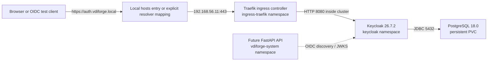

# Keycloak, OIDC, and RBAC Foundation

Phase 5 establishes the working VDIForge identity platform. It deploys Keycloak, persists its configuration in PostgreSQL, exposes Keycloak through local HTTPS ingress, imports the `vdiforge` realm from source control, and validates Authorization Code Flow with PKCE.

Phase 5 did not implement the React portal, FastAPI API, Guacamole, Ubuntu image pipeline, or VDI desktop provisioning. Later phases now consume this identity foundation; Phase 9 uses the `vdiforge-frontend` public client from the React portal.

## Component Versions

| Component | Selected version | Role |
| --- | --- | --- |
| Keycloak | `26.7.2` | OIDC provider and realm/role authority |
| PostgreSQL | `18.0-alpine` | Persistent Keycloak database |
| Traefik Helm chart | `41.2.0` | Local ingress controller |
| Traefik Proxy | `v3.7.10` | HTTPS ingress data plane from the chart |
| Helm | `v4.2.4` | Administrative deployment client |
| Kubernetes | `v1.36.4` | Runtime platform |

References:

- [Keycloak downloads](https://www.keycloak.org/downloads.html)
- [Keycloak database configuration](https://www.keycloak.org/server/db)
- [Keycloak reverse proxy configuration](https://www.keycloak.org/server/reverseproxy)
- [Keycloak realm import/export](https://www.keycloak.org/server/importExport)
- [Keycloak OIDC endpoints and flows](https://www.keycloak.org/securing-apps/oidc-layers)
- [Keycloak health endpoints](https://www.keycloak.org/observability/health)
- [Traefik Helm chart releases](https://github.com/traefik/traefik-helm-chart/releases)

## Architecture



Traffic from the browser reaches Keycloak over HTTPS. Traefik terminates local TLS and forwards to Keycloak over cluster-internal HTTP. Keycloak is configured to trust forwarded headers from the local cluster and host-only network so issuer URLs remain `https://auth.vdiforge.local/realms/vdiforge`.

## Deployment Model

Keycloak is managed by the VDIForge Helm chart:

```bash
helm upgrade --install vdiforge ./helm/vdiforge \
  --namespace vdiforge-system \
  --values ./helm/vdiforge/values-local.yaml \
  --values ./helm/vdiforge/values-phase5-local.yaml \
  --take-ownership \
  --force-conflicts \
  --wait
```

Traefik is installed as a separate Helm release because it is shared ingress infrastructure, not an application component of VDIForge:

```bash
helm upgrade --install traefik traefik/traefik \
  --namespace ingress-traefik \
  --version 41.2.0 \
  --values helm/traefik/values-local.yaml \
  --wait
```

Helm runs from `vdi-control-01`, the current administrative node. Helm is not installed on every Kubernetes node.

## Placement

Identity workloads are platform services and target:

```yaml
vdiforge.io/node-role: platform
```

The live lab expects Keycloak, PostgreSQL, and Traefik to run on `vdi-worker-01`. Templates use the platform role label rather than hardcoded node names.

The VDI/KubeVirt worker, `vdi-worker-02`, remains reserved for future VDI VM workloads.

## Persistence

Keycloak uses a single PostgreSQL StatefulSet for local lab persistence:

| Resource | Value |
| --- | --- |
| StatefulSet | `vdiforge-keycloak-postgres` |
| Namespace | `keycloak` |
| StorageClass | `vdiforge-local-path` |
| PVC size | `5Gi` |
| Exposure | ClusterIP only |

This is not a high-availability database. It is intentionally simple, free, and adequate for the portfolio lab. The database survives ordinary Keycloak pod recreation, but it is still tied to local-path storage on the worker node. Future production deployment should use managed PostgreSQL or a deliberately operated HA PostgreSQL design.

## Local DNS, Ingress, and TLS

The identity endpoint is:

```text
https://auth.vdiforge.local
```

Local name mapping:

```text
192.168.56.11 auth.vdiforge.local vdiforge.local grafana.vdiforge.local
```

The future names `vdiforge.local` and `grafana.vdiforge.local` are reserved now, but Phase 5 only deploys `auth.vdiforge.local`.

TLS uses a generated local development CA and an `auth.vdiforge.local` leaf certificate. Runtime keys and certificates are created under:

```text
.local/phase5/
```

That directory is ignored by Git. The CA private key and TLS private key must not be committed.

On Windows, run the helper from an elevated PowerShell window after copying the CA certificate locally:

```powershell
.\scripts\phase5-windows-hosts-and-trust.ps1
```

The automated OIDC validation uses trusted TLS with the generated CA. It may use an explicit resolver mapping for `auth.vdiforge.local` during non-browser tests so validation does not require editing `/etc/hosts` on the Linux control node.

## Realm as Code

The authoritative source-controlled realm file is:

```text
keycloak/realm/vdiforge-realm.json
```

The Helm chart imports the same JSON from:

```text
helm/vdiforge/files/keycloak/vdiforge-realm.json
```

The static validator requires both files to match.

The realm import creates:

| Object | Name |
| --- | --- |
| Realm | `vdiforge` |
| Public browser client | `vdiforge-frontend` |
| API audience client | `vdiforge-api` |
| Roles | `vdi-user`, `vdi-developer`, `vdi-devops`, `vdi-admin` |
| Demo users | `demo-user`, `demo-developer`, `demo-devops`, `demo-admin` |

User passwords are not included in the realm JSON. They are generated locally and set with the Keycloak admin CLI after import.

Because the public frontend client has `fullScopeAllowed` disabled, `scripts/phase5-configure-keycloak.sh` also enforces explicit realm-role scope mappings for the four VDIForge roles. This keeps role claims available to the future API without granting the browser client unrestricted realm scope.

## OIDC Client

`vdiforge-frontend` is a public OIDC client for the future browser portal:

| Setting | Value |
| --- | --- |
| Client ID | `vdiforge-frontend` |
| Client type | Public |
| Flow | Authorization Code Flow |
| PKCE | S256 |
| Implicit flow | Disabled |
| Direct access grants | Disabled |
| Client secret | None |
| Redirect URI | `https://vdiforge.local/oidc/callback` |
| Web origin | `https://vdiforge.local` |
| Post-logout redirect | `https://vdiforge.local/` |

`vdiforge-api` is the audience marker consumed by the Phase 7 FastAPI resource server. Phase 5 created the identity configuration but did not deploy FastAPI.

## JWT Claims

The FastAPI backend treats Keycloak as the identity source and validates access tokens before using claims.

Required validation:

| Claim or input | Requirement |
| --- | --- |
| `iss` | Must equal `https://auth.vdiforge.local/realms/vdiforge` |
| `aud` | Must contain `vdiforge-api` where audience validation is required |
| `exp` | Must be in the future |
| signature | Must verify with the realm JWKS |
| `sub` | Required stable user identifier |
| `preferred_username` | Required display/login identifier |
| `roles` | Contains only trusted Keycloak role claims |

The frontend must not send roles in request bodies as an authorization source. Hidden buttons are user experience only. Server-side authorization remains a Phase 7 responsibility.

## Roles and Demo Identities

Roles are realm roles. Composite inheritance is used to make higher roles include lower-role capabilities:

```text
vdi-admin -> vdi-devops -> vdi-developer -> vdi-user
```

| Demo identity | Expected role claims |
| --- | --- |
| `demo-user` | `vdi-user` |
| `demo-developer` | `vdi-user`, `vdi-developer` |
| `demo-devops` | `vdi-user`, `vdi-developer`, `vdi-devops` |
| `demo-admin` | `vdi-user`, `vdi-developer`, `vdi-devops`, `vdi-admin` |

These identity claims enable later phases to enforce the image-access policy:

| Image | Allowed roles |
| --- | --- |
| Ubuntu Base | all VDIForge roles |
| Ubuntu Developer | `vdi-developer`, `vdi-devops`, `vdi-admin` |
| Ubuntu DevOps | `vdi-devops`, `vdi-admin` |

## Secrets

Runtime secrets are created with:

```bash
bash scripts/phase5-create-local-secrets.sh
```

The script creates:

| Secret | Namespace | Purpose |
| --- | --- | --- |
| `vdiforge-keycloak-secrets` | `keycloak` | Keycloak admin, database, and demo-user passwords |
| `vdiforge-keycloak-tls` | `keycloak` | TLS certificate/key for `auth.vdiforge.local` |

The generated local environment file is:

```text
.local/phase5/phase5.env
```

It is intentionally ignored by Git.

## NetworkPolicies

Phase 5 extends the Helm-managed NetworkPolicy model in the `keycloak` namespace:

| Policy | Purpose |
| --- | --- |
| `keycloak-default-deny` | Deny ingress and egress by default for identity namespace pods. |
| `keycloak-allow-dns` | Allow DNS egress to CoreDNS. |
| `keycloak-allow-ingress-controller` | Allow Traefik to reach Keycloak on HTTP 8080. |
| `keycloak-allow-keycloak-to-postgres` | Allow Keycloak to reach PostgreSQL on 5432. |
| `keycloak-allow-postgres-from-keycloak` | Allow PostgreSQL ingress only from Keycloak pods. |
| `keycloak-allow-future-api` | Reserve the future API-to-Keycloak discovery/JWKS path. |

PostgreSQL is not exposed outside the cluster.

## Validation

Static validation from the repository root:

```powershell
.\scripts\validate-phase5.ps1
```

Live validation from `vdi-control-01`:

```bash
cd ~/vdiforge-phase5-validation
bash scripts/validate-phase5-live.sh
```

The live validator checks:

- Helm lint and rendered manifests
- Traefik deployment
- runtime-only secret generation
- Keycloak and PostgreSQL deployment
- node placement on the platform worker
- trusted HTTPS discovery and JWKS
- Authorization Code Flow with PKCE
- JWT signature, issuer, audience, and expiration validation
- role claims for all demo identities
- negative security cases
- persistence after Keycloak pod recreation
- NetworkPolicy enforcement
- Phase 4 foundation regression
- Kubernetes, KubeVirt, CDI, storage, metrics, and KVM regression health

## Negative Tests

The PKCE/JWT test helper validates that:

| Test | Expected result |
| --- | --- |
| Invalid credentials | No authorization code is issued. |
| Invalid redirect URI | Authorization request is rejected. |
| Invalid PKCE verifier | Token exchange is rejected. |
| Tampered JWT | Signature validation fails. |
| Expired JWT | Token validation fails. |
| Wrong issuer | Token validation fails. |
| Wrong audience | Token validation fails. |
| Unauthorized admin role | `demo-user` lacks `vdi-admin`. |

## Phase 12 Identity Hardening

Phase 12 applies and validates local-lab Keycloak hardening without changing the realm model:

- `vdiforge-frontend` remains a public client with Authorization Code Flow and PKCE S256.
- Implicit flow, direct grants for the browser client, wildcard redirects, wildcard web origins, and browser client secrets remain disabled.
- Brute-force protection is enabled for the `vdiforge` realm with bounded wait times appropriate for the lab.
- Demo identities remain local non-production users and their passwords are generated outside Git.
- OIDC/JWT regression tests continue to validate discovery, JWKS, signature, issuer, audience, expiration, role claims, and negative token cases.

The hardening helper is:

```bash
bash scripts/phase12-keycloak-hardening.sh
```

## Operations Notes

Inspect Keycloak:

```bash
kubectl -n keycloak get pods,svc,ingress,pvc
kubectl -n keycloak logs deployment/vdiforge-keycloak
```

Check discovery through ingress:

```bash
curl --cacert .local/phase5/tls/vdiforge-local-ca.crt \
  --resolve auth.vdiforge.local:443:192.168.56.11 \
  https://auth.vdiforge.local/realms/vdiforge/.well-known/openid-configuration
```

Restart Keycloak without destroying storage:

```bash
kubectl -n keycloak delete pod -l app.kubernetes.io/name=vdiforge-keycloak
kubectl -n keycloak rollout status deployment/vdiforge-keycloak --timeout=600s
```

Do not delete the PostgreSQL PVC unless intentionally resetting the identity lab.

## Known Limitations

- The PostgreSQL database is single-instance and local-path backed.
- Local TLS uses a development CA, not a public CA.
- Browser trust requires importing the local CA on each client.
- Local hostnames require a hosts-file entry or equivalent local DNS.
- Phase 5 proves identity claims, not VDIForge application authorization.
- Phase 12 documents the React portal token-storage tradeoff: `sessionStorage` is acceptable for the local lab but does not provide the isolation of a backend-for-frontend production design.
