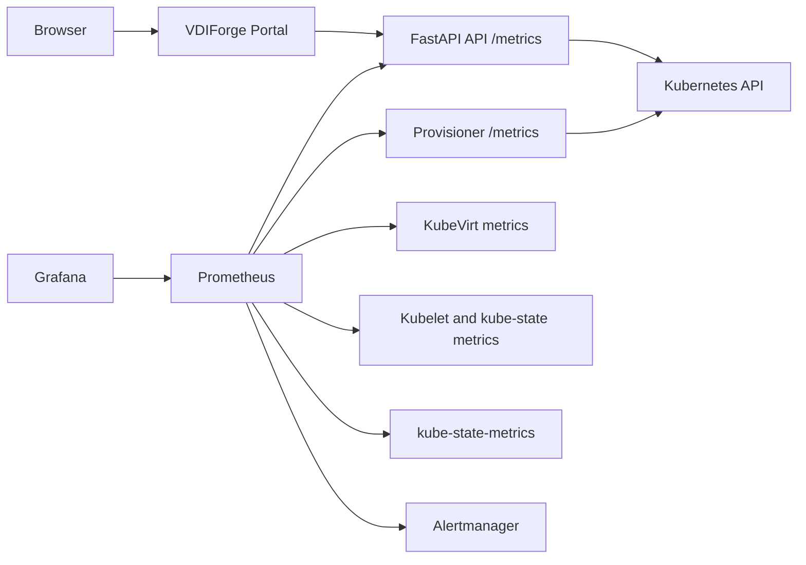

# Prometheus and Grafana Observability

Phase 11 implements the VDIForge observability stack. It adds Prometheus, Grafana, Alertmanager, kube-state-metrics, VDIForge application metrics, ServiceMonitors, alert rules, dashboard-as-code, and live validation while keeping Metrics Server in place for Kubernetes HPA.

Metrics Server remains the resource-metrics source for Kubernetes HPA. Prometheus stores and queries platform, Kubernetes, KubeVirt, and application telemetry for dashboards, troubleshooting, alerting, and portfolio demonstration.

## Status

| Item | Value |
| --- | --- |
| Phase | 11 |
| Monitoring namespace | `monitoring` |
| Upstream chart | `prometheus-community/kube-prometheus-stack` |
| Chart version | `88.6.1` |
| Prometheus Operator app version | `v0.93.1` |
| Grafana access | `https://grafana.vdiforge.local` |
| Grafana credentials | Kubernetes Secret `vdiforge-grafana-admin`, generated from `.local/phase11/phase11.env` |
| StorageClass | `vdiforge-local-path` |
| Retention | 3 days / 3 GiB in the local lab |
| Node exporter | Disabled in the local baseline to keep `monitoring` at baseline Pod Security |
| VDIForge chart version | `0.14.0` |

References used for the version and integration decisions:

- [kube-prometheus-stack Chart.yaml](https://raw.githubusercontent.com/prometheus-community/helm-charts/main/charts/kube-prometheus-stack/Chart.yaml)
- [kube-prometheus-stack values](https://raw.githubusercontent.com/prometheus-community/helm-charts/main/charts/kube-prometheus-stack/values.yaml)
- [KubeVirt component monitoring](https://kubevirt.io/user-guide/user_workloads/component_monitoring/)
- [Prometheus Python client instrumentation](https://prometheus.github.io/client_python/instrumenting/)

## Compatibility Matrix

| Component | Selected version | Status | Evidence |
| --- | --- | --- | --- |
| Ubuntu | 26.04 LTS | PASS | Existing Phase 3-10 live cluster and Phase 11 validation target. |
| Kubernetes | v1.36.4 | PASS | Existing cluster version and kube-prometheus-stack `kubeVersion >=1.25.0-0`. |
| Metrics Server | v0.8.1 | PASS | Retained for HPA; validated with `kubectl top nodes`. |
| KubeVirt | v1.9.0 | PASS | KubeVirt exposes component metrics and VMI metrics with the `kubevirt_vmi` prefix. |
| CDI | v1.66.0 | PASS | Existing CDI deployment remains healthy and is not modified by Phase 11. |
| kube-prometheus-stack | 88.6.1 | PASS | Pinned upstream Helm chart. |
| Prometheus Operator | v0.93.1 | PASS | Chart app version. |
| Grafana chart | 12.11.2 | PASS | Pinned dependency of kube-prometheus-stack 88.6.1. |

## Architecture



## Ownership

The monitoring namespace is created by the Phase 3 namespace foundation. Phase 11 adds two ownership layers:

| Owner | Resources |
| --- | --- |
| `kube-prometheus-stack` release `vdiforge-monitoring` | Prometheus, Grafana, Alertmanager, Prometheus Operator, kube-state-metrics, CRDs, dashboards sidecar, monitoring persistence. |
| VDIForge release `vdiforge` | API/provisioner ServiceMonitors, VDIForge alert rules, VDIForge Grafana dashboard ConfigMap, monitoring NetworkPolicy allowance. |

Operators should modify these resources through Helm values and Git, then run Helm upgrade. Manual `kubectl edit` changes are drift and can be overwritten by the next Helm release.

## Installation

Run from `vdi-control-01` after Phase 10 is healthy:

```bash
cd ~/vdiforge-phase11-validation
bash scripts/phase11-install-monitoring.sh
```

The installer:

- creates or refreshes local Grafana admin and TLS Secrets;
- installs or upgrades `kube-prometheus-stack` with `monitoring/kube-prometheus-stack-values-local.yaml`;
- patches the KubeVirt CR so KubeVirt creates Prometheus Operator monitoring resources in `monitoring`;
- builds and loads the current VDIForge API image for the active phase;
- upgrades the existing `vdiforge` release with Phase 1-11 values and later compatible overlays when validating a newer phase.

The Windows hosts file must include:

```text
192.168.56.11 grafana.vdiforge.local
```

The Phase 5 host helper remains the canonical local DNS/TLS helper for browser-facing lab names.

## Grafana Access

The local Grafana admin username and password are generated outside Git:

```bash
cat .local/phase11/phase11.env
```

Open:

```text
https://grafana.vdiforge.local
```

The initial local lab uses Grafana basic authentication with a generated admin Secret. Keycloak OIDC for Grafana is deferred because it requires a dedicated Grafana OIDC client, callback URL policy, secret management, and role-mapping decisions that belong in security hardening rather than this foundation phase.

## Application Metrics

The API exposes `/metrics` using `prometheus-client`. The provisioner exposes metrics on port `9102`.

| Metric | Type | Labels | Purpose |
| --- | --- | --- | --- |
| `vdiforge_api_requests_total` | counter | `method`, `route`, `status_code` | API rate and error analysis. |
| `vdiforge_api_request_duration_seconds` | histogram | `method`, `route`, `status_code` | API latency and P50/P95 queries. |
| `vdiforge_desktop_provision_requests_total` | counter | `image_id`, `result` | Accepted, rejected, and replayed launch requests. |
| `vdiforge_desktop_provision_failures_total` | counter | `image_id`, `reason` | Provisioning failure tracking. |
| `vdiforge_desktop_provision_duration_seconds` | histogram | `image_id`, `result` | Provisioning latency. |
| `vdiforge_desktops_active` | gauge | none | Non-terminal desktop count. |
| `vdiforge_desktops_by_state` | gauge | `state` | Desktop lifecycle state counts. |
| `vdiforge_remote_sessions_active` | gauge | `protocol` | Approximate active brokered sessions by TTL. |
| `vdiforge_provisioner_reconcile_total` | counter | `result` | Reconciler loop health. |
| `vdiforge_provisioner_reconcile_failures_total` | counter | `reason` | Reconciler failure modes. |
| `vdiforge_provisioner_reconcile_duration_seconds` | histogram | `result` | Reconciler latency. |
| `vdiforge_provisioner_pending_operations` | gauge | none | Pending asynchronous operations. |

Metrics intentionally avoid high-cardinality labels. Do not add labels containing desktop IDs, request IDs, usernames, token subjects, Guacamole connection IDs, raw URLs, or JWT data.

## Scraping

The VDIForge chart creates ServiceMonitors in `monitoring`:

| ServiceMonitor | Scraped service | Namespace | Endpoint |
| --- | --- | --- | --- |
| `vdiforge-api` | `vdiforge-api` | `vdiforge-system` | `/metrics` on port `http` |
| `vdiforge-provisioner` | `vdiforge-provisioner-metrics` | `vdiforge-system` | `/metrics` on port `metrics` |

The kube-prometheus-stack values allow ServiceMonitor, PodMonitor, and PrometheusRule discovery across namespaces in this local lab. NetworkPolicy allows Prometheus in `monitoring` to scrape the API and provisioner metrics endpoints without opening broader platform access.

## KubeVirt Metrics

Phase 11 patches the KubeVirt CR with:

```text
monitorNamespace=monitoring
monitorAccount=<Prometheus service account>
serviceMonitorNamespace=monitoring
```

This lets KubeVirt integrate with Prometheus Operator using the KubeVirt-supported monitoring path. Validation checks for KubeVirt metrics such as names matching `kubevirt_vmi.*`.

## Dashboard

Dashboard source:

```text
monitoring/grafana/vdiforge-overview.json
```

Chart-packaged copy:

```text
helm/vdiforge/files/grafana/vdiforge-overview.json
```

Dashboard title:

```text
VDIForge Overview
```

The dashboard includes:

- active desktops;
- desktops by state;
- API request rate;
- API error rate;
- API latency;
- API replica count and HPA desired/current replicas;
- provisioning request/failure rate;
- P50/P95 provisioning latency;
- API and provisioner CPU/memory;
- worker-node pod memory utilization from kubelet and kube-state metrics;
- Kubernetes node health;
- KubeVirt VMI state;
- active remote sessions;
- pending provisioning operations.

## Alerts

The VDIForge chart creates `PrometheusRule` `vdiforge-alerts` with:

| Alert | Purpose |
| --- | --- |
| `VDIForgeAPIDown` | API metrics target is absent or unhealthy. |
| `VDIForgeHighAPIErrorRate` | API 5xx ratio is above the local threshold. |
| `VDIForgeHighProvisionFailureRate` | Provisioning failures are frequent compared with accepted launches. |
| `VDIForgeSlowProvisioning` | P95 provisioning latency exceeds the configured local threshold. |
| `KubernetesNodeNotReady` | At least one node reports Ready=false. |
| `VDIWorkerHighMemory` | `vdi-worker-02` pod memory working set is high relative to Kubernetes allocatable memory. |

Alertmanager is deployed but no external notification receiver is configured in Phase 11. That keeps the lab free and avoids committing notification credentials.

## Phase 12 Security Review

Phase 12 does not replace the Phase 11 observability architecture. It hardens and validates it:

- Grafana local values set security options for content-type protection, HSTS, CSP, secure cookies, and embedding prevention where compatible.
- Traefik applies a Grafana security-header middleware at `grafana.vdiforge.local`.
- Metrics are scanned to avoid usernames, token subjects, request IDs, desktop IDs, raw URLs, and credentials in labels.
- Grafana remains a telemetry UI, not the source of audit truth.
- Audit export remains in the VDIForge API as admin-only JSON Lines.

## Validation

Static validation from the Windows repository checkout:

```powershell
.\scripts\validate-phase11.ps1
```

Live validation from `vdi-control-01`:

```bash
cd ~/vdiforge-phase11-validation
bash scripts/validate-phase11-live.sh
```

Live validation checks:

- all three Kubernetes nodes remain Ready;
- Calico, CoreDNS, Metrics Server, KubeVirt, CDI, and KVM remain healthy;
- kube-prometheus-stack installs successfully;
- VDIForge ServiceMonitors, PrometheusRule, and dashboard ConfigMap exist;
- Prometheus scrapes API, provisioner, HPA, Kubernetes node, and KubeVirt metrics;
- Grafana loads over HTTPS and finds `VDIForge Overview`;
- a temporary alert fires and is removed;
- the Phase 10 safe API load still works and is observable;
- a controlled desktop lifecycle still works and emits provisioning metrics;
- no unexpected failed pods remain.

## Troubleshooting

Useful checks:

```bash
kubectl -n monitoring get pods,svc,ingress,pvc
kubectl -n monitoring get servicemonitor,prometheusrule
kubectl -n monitoring logs deploy/vdiforge-monitoring-grafana
kubectl -n monitoring logs deploy/vdiforge-monitoring-operator
kubectl -n monitoring port-forward svc/vdiforge-monitoring-prometheus 19090:9090
curl -fsS http://127.0.0.1:19090/-/ready
curl -fsS https://api.vdiforge.local/metrics --cacert .local/phase5/tls/vdiforge-local-ca.crt --resolve api.vdiforge.local:443:192.168.56.11
```

If Grafana opens but the VDIForge dashboard is missing, verify the dashboard ConfigMap has label `grafana_dashboard=1` and that the Grafana sidecar searches all namespaces.

If Prometheus lacks VDIForge targets, verify the ServiceMonitors exist, the services have matching labels, and NetworkPolicy allows `monitoring` to reach the metrics ports.

## Limitations

- Local-path storage is not highly available.
- Grafana uses generated basic-auth credentials for the local lab; Keycloak OIDC is deferred.
- Alertmanager has no external receiver in this phase.
- Remote-session active metrics are approximate because Guacamole disconnect telemetry is not yet durable.
- Prometheus/Grafana do not replace structured application logs or persistent audit events.
- Phase 12 still does not deploy a SIEM or external log aggregation pipeline.
